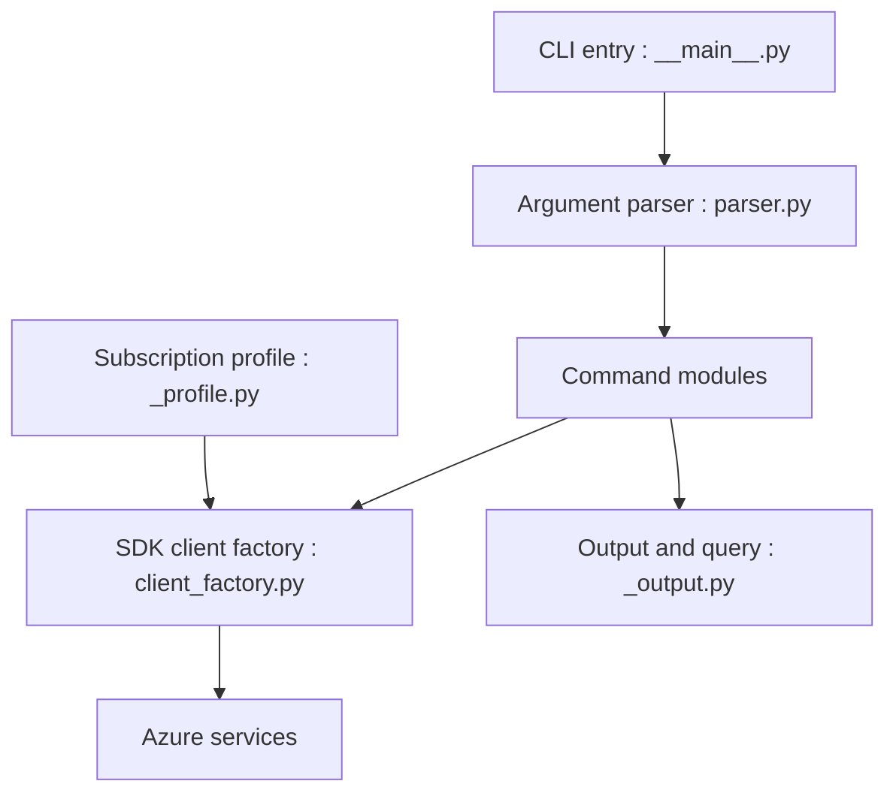

# Azure/azure-cli

> Ligne de commande officielle de Microsoft pour gérer les ressources Azure, multi-plateforme.

## Le problème
Piloter Azure par scripts plutôt que par le portail.

## Ce que ça fait vraiment
Commande `az groupe sous-groupe commande`. Le cœur analyse les arguments, appelle les API Azure via des modules de commandes, gère l'authentification, la sortie et les extensions. Complétion par tabulation, requêtes JMESPath, `az rest`, codes de sortie documentés.

## Comment c'est branché


## Essayer
```bash
az storage -h
az vm create -h
az vm list --query "[?provisioningState=='Succeeded'].{ name: name, os: storageProfile.osDisk.osType }"
az config set core.collect_telemetry=no
```

## Coût et pièges
L'outil est gratuit, les ressources Azure ne le sont pas. Télémétrie activée par défaut ; désactivation par `az config set core.collect_telemetry=no`. 3 984 issues ouvertes.

## Ce que ce n'est pas
Inutile hors Azure. Les builds « edge » du README sont des versions de développement.

## Alternatives
Aucune alternative nommée dans le README.

## Pour toi
À surveiller : indispensable si tes workloads ML tournent sur Azure, sans intérêt sinon ; pense à couper la télémétrie.

