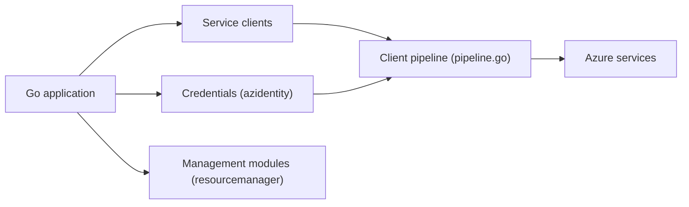

# Azure/azure-sdk-for-go

> Bibliothèques Go officielles de Microsoft pour utiliser et administrer les services Azure.

## Le problème
Appeler les services Azure (stockage, bus de messages, Cosmos, ressources) depuis Go avec authentification, relances et journalisation cohérentes.

## Ce que ça fait vraiment
- Modules « client » (consommer un service, par ex. envoyer un blob) et « management » (configurer les ressources) dans `/sdk`.
- Noyau azcore partagé : pipeline HTTP, retries, journalisation, transport.
- Authentification via azidentity (Microsoft Entra ID).
- L'ancien module racine `services/**/mgmt/**` est déprécié.

## Comment c'est branché


## Essayer
Aucune commande d'installation explicite ; le README fournit un exemple Go désactivant la télémétrie :
```go
clientOpts := policy.ClientOptions{
	Telemetry: policy.TelemetryOptions{Disabled: true},
}
```

## Coût et pièges
Le SDK est gratuit, les ressources Azure sont facturées. La télémétrie est activée par défaut ; il faut la couper pour chaque client et chaque identifiant. 286 issues ouvertes.

## Ce que ce n'est pas
Pas un client multi-cloud. Les modules en bêta ne sont pas pour la production.

## Alternatives
Aucune alternative nommée dans le README.

## Pour toi
À adopter si tu déploies sur Azure avec du Go (outillage MLOps, opérateurs) : SDK officiel, activement maintenu ; sinon sans objet.

