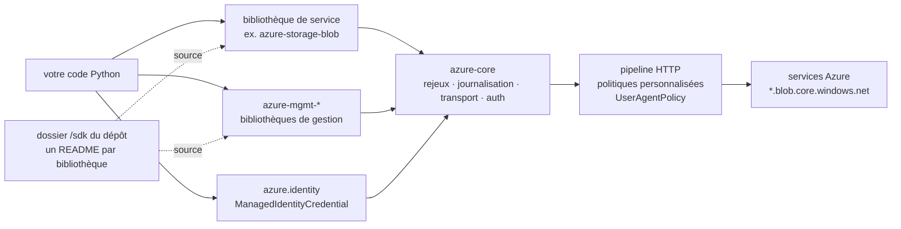

# Azure/azure-sdk-for-python

> **Le mono-dépôt de développement des bibliothèques clientes Python d'Azure, une par service.**

## Le problème

Parler à un service Azure depuis Python sans bibliothèque cliente, c'est écrire soi-même
l'authentification, les jetons, les rejeux, la pagination, les délais d'attente et le suivi
distribué, service par service, chacun avec sa propre API REST et ses propres codes d'erreur.

## Ce que ça fait vraiment

C'est le dépôt de **développement** des SDK, pas un paquet à installer : le README renvoie
explicitement les consommateurs vers la documentation publique et les paquets publiés.

Il héberge, sous `/sdk`, une bibliothèque distincte par service Azure, chacune avec son propre
`README.md` (ou `README.rst`) dans son dossier de projet. On installe la bibliothèque du service
dont on a besoin, pas un gros paquet `azure` unique.

Les bibliothèques clientes « nouvelle vague » partagent un socle commun, `azure-core` : rejeux,
journalisation, protocoles de transport, protocoles d'authentification. Les bibliothèques de
gestion récentes y ajoutent la bibliothèque d'identité Azure, un pipeline HTTP à politiques
personnalisées, la gestion d'erreurs et le suivi distribué.

Le README distingue quatre familles de paquets : client nouvelles versions (GA et préversion),
client versions précédentes, gestion nouvelles versions, gestion versions précédentes. Les
paquets de gestion se reconnaissent à leur espace de noms `azure-mgmt-`, par exemple
`azure-mgmt-compute`. Les versions précédentes couvrent plus de services mais ne suivent pas
forcément les lignes directrices de conception.

## Comment c'est branché

Aucun diagramme tiré du code n'existe pour ce dépôt : le schéma ci-dessous est reconstruit
depuis le seul README, avec les noms qu'il cite.



## Essayer

Le README **ne documente aucune commande d'installation ni d'exécution** : il indique que chaque
service a ses propres bibliothèques et renvoie au `README.md` du dossier de la bibliothèque
voulue dans `/sdk`. Rien n'est reconstruit ici. Le seul code du README est l'exemple Python de
désactivation de la télémétrie, qui montre au passage la forme d'un client :

```bash
# Aucune commande d'installation n'est donnée par le README de ce dépôt.
# Il renvoie au README de chaque bibliothèque, dans son dossier sous /sdk.
# Extrait Python du README (désactivation de la télémétrie) :
#   from azure.identity import ManagedIdentityCredential
#   from azure.storage.blob import BlobServiceClient
#   from azure.core.pipeline.policies import UserAgentPolicy
#   class NoUserAgentPolicy(UserAgentPolicy):
#       def on_request(self, request): pass
#   blob_service_client = BlobServiceClient(
#       account_url, credential=mi_credential,
#       user_agent_policy=NoUserAgentPolicy())
```

## Coût et pièges

- **Télémétrie activée par défaut.** Le README l'écrit noir sur blanc : le logiciel peut collecter
  des informations sur vous et votre usage et les envoyer à Microsoft. La désactivation n'est pas
  un interrupteur global : il faut définir une sous-classe `NoUserAgentPolicy` de `UserAgentPolicy`
  et la passer en `user_agent_policy=` **à la construction de chaque nouveau client**. Oublier un
  client suffit à rouvrir le canal.
- **Compte et abonnement Azure indispensables** : les bibliothèques consomment des ressources
  existantes (« upload a blob ») ou les provisionnent ; la facture est celle des services Azure,
  pas du SDK. Il faut aussi des identifiants — le README montre `ManagedIdentityCredential`.
- **Versions de Python** : le support est multiple mais encadré par une politique dédiée
  (`doc/python_version_support_policy.md`), à vérifier avant de figer un environnement.
- **Préversions** : le README avertit deux fois que pour de la production il faut choisir une
  bibliothèque stable, hors préversion.
- **Migration des bibliothèques de gestion** : après montée de version, des problèmes
  d'authentification surviennent si le code d'auth n'est pas repris ; un guide de migration est
  signalé (`doc/sphinx/mgmt_quickstart.rst`).
- **Contribuer impose un CLA Microsoft** (cla.microsoft.com), vérifié par un robot sur chaque
  pull request.

## Ce que ce n'est pas

- **Ce n'est pas un paquet.** On n'installe pas « le SDK Azure pour Python » : ce dépôt est
  l'atelier de développement, et le README redirige les utilisateurs vers les paquets publiés et
  la documentation. Les 5 600 étoiles portent sur un mono-dépôt, pas sur une bibliothèque.
- **Ce n'est pas une couche d'abstraction sur plusieurs nuages** : tout est spécifique à Azure,
  et le code écrit avec ces bibliothèques ne se transporte pas ailleurs.
- **Ce n'est pas homogène** : les « versions précédentes » couvrent plus de services mais ne
  suivent pas les lignes directrices ni le même jeu de fonctionnalités que les nouvelles. Selon le
  service visé, on ne trouve pas la même qualité d'API.

## Alternatives

Aucune alternative comparable dans le catalogue : les voisins fournis
(`TheAlgorithms/Python`, `AtsushiSakai/PythonRobotics`, `Avaiga/taipy`, `oppia/oppia`) sont des
projets pédagogiques, de robotique, d'interface de données ou d'éducation, sans rapport avec des
bibliothèques clientes de fournisseur de nuage. La seule comparaison utile est interne au README :
bibliothèques **client** (consommer une ressource, par exemple déposer un blob) contre
bibliothèques **de gestion** `azure-mgmt-*` (provisionner et administrer la ressource) — et, pour
chaque service, nouvelle version guidée contre version précédente à couverture plus large.

## Pour toi

Si une partie de ta chaîne data ou MLOps est sur Azure, c'est la dépendance obligée, et le bon
réflexe est d'installer la bibliothèque du service visé plutôt qu'un paquet global, en suivant
son README sous `/sdk`. Le point à traiter dès le premier client : la télémétrie par défaut, qui
doit être désactivée client par client si ta politique interne l'exige. Sinon, passe ton chemin —
rien ici ne sert hors Azure.
