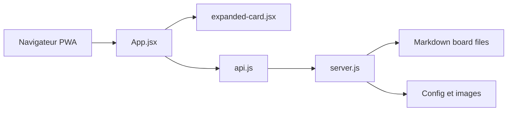

# BaldissaraMatheus/Tasks.md

> Tableau de tâches auto-hébergé où chaque carte est un fichier Markdown et chaque colonne un dossier.

## Le problème
Les outils de gestion de tâches enferment les données ; on veut un tableau simple qui reste lisible dans un dossier de fichiers.

## Ce que ça fait vraiment
Interface web (SolidJS) et serveur Koa : chaque colonne est un répertoire, chaque tâche un fichier Markdown, éditable aussi dans Obsidian. Cartes, colonnes et étiquettes, thèmes (Adwaita, Nord, Catppuccin), multilingue, installable en PWA, sous-dossiers ouvrables comme projets distincts. Une seule image Docker suffit.

## Comment c'est branché


## Essayer
```bash
docker run -d \
  --name tasks.md \
  -e PUID=1000 \
  -e PGID=1000 \
  -p 8080:8080 \
  -v /path/to/tasks/:/tasks/ \
  -v /path/to/config/:/config/ \
  --restart unless-stopped \
  baldissaramatheus/tasks.md
```

## Coût et pièges
Gratuit. Remplacer les chemins par des dossiers existants ; PUID/PGID recommandés sinon fichiers créés en root. Le PWA ne fonctionne pas avec un `BASE_PATH` autre que « / ».

## Ce que ce n'est pas
Pas un outil collaboratif riche : projet à maintenance volontairement faible, fonctionnalités limitées. Aucune authentification n'est décrite dans le README.

## Alternatives
- Aucune alternative nommée dans le README.

## Pour toi
Surveiller : agréable pour un kanban personnel en Markdown, sans rapport avec ton métier data/IA.
