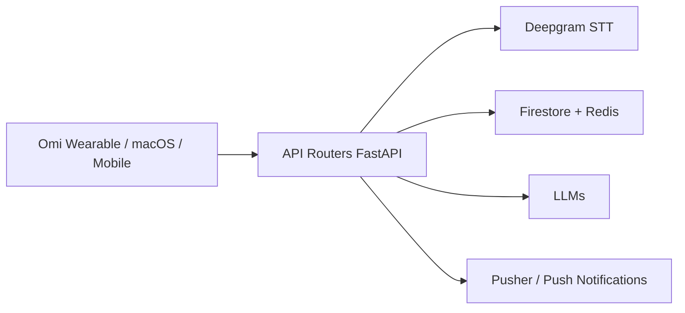

# BasedHardware/omi

> Assistant qui capture écran et conversations, les transcrit et les résume, sur bureau, mobile ou objet connecté.

## Le problème
On oublie ce qu'on a vu et dit ; il faut une mémoire consultable par une IA.

## Ce que ça fait vraiment
Le backend Python/FastAPI reçoit l'audio (REST et WebSocket), le transcrit via Deepgram, l'analyse (VAD et diarisation sur GPU) et stocke sur Firestore et Redis avec des LLM. Clients : app macOS (Swift), Windows, mobile Flutter, firmware nRF et lunettes ESP32-S3. SDK, serveur MCP et API pour construire des apps.

## Comment c'est branché


## Essayer
```bash
git clone https://github.com/BasedHardware/omi.git && cd omi/desktop/macos && ./run.sh --yolo
make setup
```

## Coût et pièges
Le mode rapide se connecte au backend cloud. Un déploiement complet implique clés et services (Deepgram, LLM, Firebase). 1 164 issues ouvertes. La capture d'écran et de voix pose des questions de vie privée.

## Ce que ce n'est pas
Pas un outil purement local : le démarrage par défaut passe par le cloud du projet.

## Alternatives
Aucune alternative citée dans le README.

## Pour toi
À surveiller : bonne étude d'un pipeline audio, transcription et LLM, mais lourd à héberger et sensible côté données personnelles.

