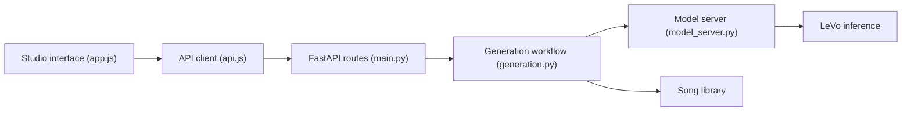

# BazedFrog/SongGeneration-Studio

> Interface web locale pour générer des chansons complètes avec le modèle LeVo de Tencent AI Lab.

## Le problème
Utiliser un modèle de génération musicale directement demande de gérer ses poids, files d'attente et sorties à la main.

## Ce que ça fait vraiment
Une interface FastAPI et JavaScript reçoit paroles structurées, style (genre, ambiance, voix, tempo) et audio de référence optionnel. Un service de génération envoie les tâches à un serveur de modèle LeVo persistant. Les pistes séparées (mixage, voix, instrumental), la bibliothèque, l'export FLAC ou MP4 et la file d'attente sont fournis.

## Comment c'est branché

## Essayer
Installation via Pinokio, décrite en étapes graphiques : ouvrir Pinokio, chercher « SongGeneration Studio », cliquer sur Install. Aucune commande shell dans le README.

## Coût et pièges
GPU NVIDIA de 10 Go de VRAM minimum (24 Go recommandés), 25 Go de disque, environ 15 Go de modèles à télécharger ; 3 à 6 minutes par chanson. Aucune licence déclarée ; la licence du modèle LeVo n'est pas discutée. Dernier push en janvier 2026.

## Ce que ce n'est pas
Pas le modèle lui-même, mais une interface autour de lui. Les conseils de qualité (« références audio ») ne sont pas mesurés.

## Alternatives
- LeVo (Tencent AI Lab) : le modèle sous-jacent, pour l'utiliser sans cette couche.

## Pour toi
À ignorer : simple interface sans licence déclarée autour d'un modèle tiers ; sans licence claire, aucun usage sérieux en équipe.
