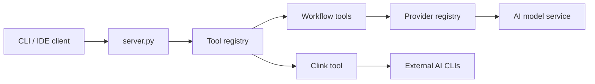

# BeehiveInnovations/pal-mcp-server

> Serveur MCP qui fait consulter plusieurs modèles et CLI d'IA depuis Claude Code, Codex ou Gemini CLI.

## Le problème
Un assistant de code n'utilise qu'un modèle ; obtenir un second avis ou déléguer une grosse analyse impose de changer d'outil et de perdre le contexte.

## Ce que ça fait vraiment
Outils MCP `chat`, `thinkdeep`, `planner`, `consensus`, `codereview`, `precommit`, `debug`, `apilookup`, `challenge` (d'autres désactivés par défaut).
Fil de conversation partagé entre modèles et outils ; contournement de la limite MCP de 25K tokens.
`clink` lance des CLI externes (Gemini, Codex, Claude Code) comme sous-agents isolés.
Fournisseurs : Gemini, OpenAI, Azure, X.AI, OpenRouter, DIAL, Ollama.

## Comment c'est branché


## Essayer
```bash
git clone https://github.com/BeehiveInnovations/pal-mcp-server.git
cd pal-mcp-server
./run-server.sh
```

## Coût et pièges
Chaque appel à un second modèle est facturé sur ta clé ; chaque outil actif consomme de la fenêtre de contexte.
Licence présente mais non identifiée par GitHub.

## Ce que ce n'est pas
Pas un agent autonome : le client principal reste aux commandes.
README très promotionnel : les gains annoncés ne sont pas mesurés.

## Alternatives
Aucune alternative nommée dans le README.

## Pour toi
À surveiller : l'idée du consensus multi-modèles pour la revue de code est utile, mais surveille la facture et vérifie la licence avant usage pro.
