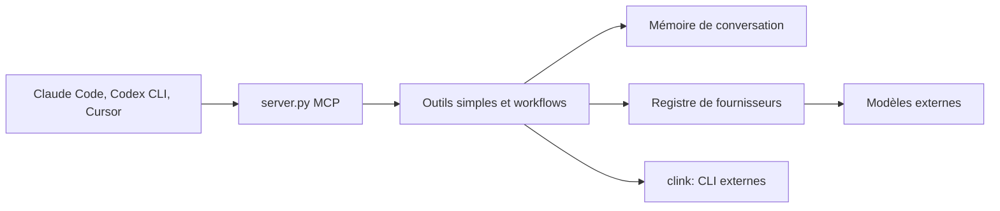

# BeehiveInnovations/zen-mcp-server

> PAL MCP (ex Zen MCP) : serveur MCP qui fait consulter plusieurs modèles à ton CLI de code.

## Le problème
Un CLI de code n'a qu'un modèle et un contexte limité ; obtenir un second avis oblige à recopier le contexte.

## Ce que ça fait vraiment
Un serveur MCP avec des outils : `chat`, `thinkdeep`, `planner`, `consensus`, `codereview`, `precommit`, `debug`, `apilookup`, `challenge`, et `clink` qui lance d'autres CLI (Gemini, Codex, Claude Code) comme sous-agents. Le fil de conversation garde le contexte entre outils et modèles. Fournisseurs : Gemini, OpenAI, Anthropic, Grok, Azure, Ollama, OpenRouter, DIAL.

## Comment c'est branché


## Essayer
```bash
git clone https://github.com/BeehiveInnovations/pal-mcp-server.git
cd pal-mcp-server
./run-server.sh
```

## Coût et pièges
Clés d'API à ta charge pour chaque fournisseur activé ; Python 3.10+, Git, uv. Chaque outil consomme de la fenêtre de contexte : certains sont désactivés par défaut via `DISABLED_TOOLS`.

## Ce que ce n'est pas
Pas un agent autonome : ton CLI garde la main. Le multi-modèles multiplie les coûts, et le contexte transmis part chez chaque fournisseur consulté. Le dépôt cité dans le README a été renommé pal-mcp-server.

## Alternatives
Aucune alternative nommée dans le README.

## Pour toi
À surveiller : les seconds avis multi-modèles sont utiles en revue de code, mais le coût et l'envoi du code à plusieurs fournisseurs se mesurent.
