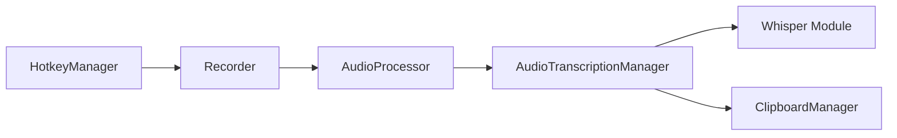

# Beingpax/VoiceInk

> Application macOS de dictée vocale locale qui transcrit la voix en texte via Whisper, pour utilisateurs Mac.

## Le problème
Taper longuement est lent, et les services de dictée cloud envoient la voix à des tiers.

## Ce que ça fait vraiment
Transcrit hors ligne avec whisper.cpp, Parakeet (FluidAudio) et SenseVoice. Raccourcis globaux (push-to-talk), dictionnaire personnel, « modes » selon l'application active, assistant vocal et amélioration IA contextuelle. Exige macOS 14.4+. Code source ouvert ; le binaire officiel est payant avec essai gratuit.

## Comment c'est branché


## Essayer
```bash
brew install --cask voiceink
```
Pour compiler : suivre BUILDING.md (non reproduit dans le README).

## Coût et pièges
Binaire payant après essai (mises à jour et support inclus) ; compilation gratuite mais sans mises à jour auto. Les fonctions « IA » peuvent appeler des services externes, non détaillé.

## Ce que ce n'est pas
Pas multiplateforme (macOS seul). La promesse « 100 % hors ligne » vise le mode local ; la licence exacte reste à vérifier.

## Alternatives
Aucune nommée dans le README (whisper.cpp cité comme brique).

## Pour toi
À surveiller : intéressant si tu es sur Mac et veux de la dictée locale ; clarifie la licence avant tout usage pro.

