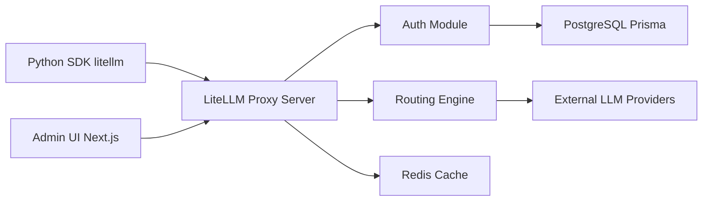

# BerriAI/litellm

> SDK Python et passerelle proxy exposant 100+ fournisseurs LLM au format OpenAI.

## Le problème
Chaque fournisseur LLM a son SDK, son auth, ses formats et erreurs ; suivre coûts et quotas par équipe devient ingérable.

## Ce que ça fait vraiment
SDK : `completion(model="provider/model", ...)` unifié, Router avec retries/fallbacks, callbacks d'observabilité (Langfuse, MLflow…).
Proxy FastAPI : clés virtuelles, suivi des dépenses, garde-fous, load balancing, cache Redis, dashboard Next.js, base Postgres via Prisma.
Passerelles MCP et A2A ; endpoints chat, embeddings, images, audio, batches, rerank.
Modules Terraform AWS/GCP ; images Docker signées cosign.

## Comment c'est branché


## Essayer
```bash
uv add litellm
uv tool install 'litellm[proxy]'
litellm --model gpt-4o
docker-compose up db prometheus
```

## Coût et pièges
Clés des fournisseurs à ta charge ; Postgres/Redis pour le proxy complet. SSO et certaines fonctions sous licence commerciale Enterprise. 5 203 issues ouvertes.

## Ce que ce n'est pas
Pas un fournisseur de modèles : un routeur. Licence non identifiée par GitHub, avec une partie commerciale. Le « 8 ms P95 » est un chiffre de l'éditeur.

## Alternatives
Non documenté : aucun dépôt alternatif nommé.

## Pour toi
Adopter comme couche d'abstraction LLM en MLOps ; vérifier ce qui relève de l'Enterprise.
