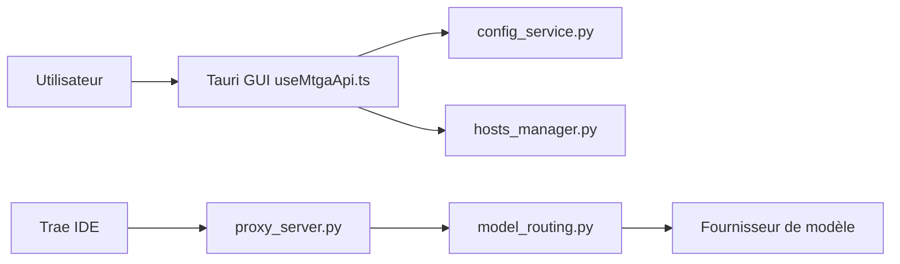

# BiFangKNT/mtga

> Proxy local de bureau qui redirige les requêtes d'un IDE (Trae) vers le fournisseur de modèle de ton choix.

## Le problème
Certains IDE n'acceptent que leur fournisseur de modèle intégré ; on veut y brancher sa propre API.

## Ce que ça fait vraiment
Application Tauri (Windows/macOS) qui expose une API OpenAI Chat Completions locale. Pour intercepter l'IDE, elle installe un certificat, modifie le fichier hosts (`127.0.0.1 api.openai.com`) et écoute le port 443. Une couche interne, MLiteLLM, traduit vers OpenAI, Responses, Anthropic ou Gemini.

## Comment c'est branché

## Essayer
Pas de ligne de commande : télécharger l'installeur depuis les releases, ajouter un groupe de configuration, puis « une clé pour tout démarrer » dans l'interface.

## Coût et pièges
Droits administrateur requis ; certificat racine et hosts modifiés ; port 443 à libérer. Clé d'API du fournisseur à ta charge. README en chinois.

## Ce que ce n'est pas
Pas une passerelle LLM serveur : c'est un détournement local pour un IDE précis. Licence AGPL : obligations en cas de redistribution.

## Alternatives
Aucune alternative citée dans le README.

## Pour toi
À ignorer : installer un certificat racine et détourner `api.openai.com` est intrusif ; une vraie passerelle LLM est préférable pour un usage sérieux.

