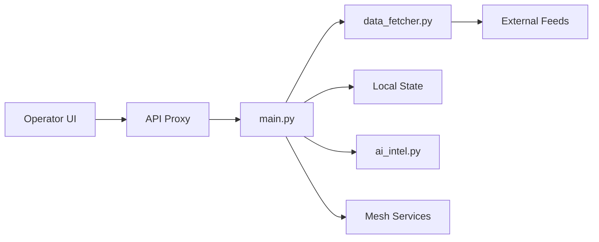

# BigBodyCobain/Shadowbroker

> Tableau de bord cartographique auto-hébergé agrégeant 60+ flux OSINT temps réel, avec canal pour agents IA.

## Le problème
Les données publiques (ADS-B, AIS, satellites, séismes, caméras, radio) sont éparpillées dans des dizaines d'outils et d'API.

## Ce que ça fait vraiment
Carte MapLibre à 40+ couches : avions, navires, satellites, conflits GDELT, CCTV, feux, brouillage GPS, Shodan, Telegram OSINT, SAR…
Backend FastAPI qui interroge les sources par paliers, boîte à outils de recon (DNS, WHOIS, BGP, sanctions, CVE) côté serveur avec garde SSRF.
Canal de commandes signé HMAC pour agents IA (lecture, épingles, contrôle de carte), relecture « Time Machine ».
Réseau maillé expérimental InfoNet avec gouvernance, explicitement sans garantie de confidentialité.

## Comment c'est branché


## Essayer
```bash
git clone https://github.com/bigbodycobain/Shadowbroker.git
cd Shadowbroker
docker compose pull
docker compose up -d
```

## Coût et pièges
Clés OpenSky, aisstream.io, CARTO et optionnellement Shodan, GFW, Earthdata ; backend limité à 4 Go et sujet aux OOM.
Nombreuses requêtes sortantes vers les fournisseurs activés.

## Ce que ce n'est pas
Pas une messagerie privée : InfoNet est un testnet non chiffré de bout en bout.
Usage sensible (suivi de personnes, caméras, scanners) : le cadre légal reste à ta charge.

## Alternatives
Aucune alternative nommée dans le README (OSIRIS est une source de code reprise, pas une alternative).

## Pour toi
À ignorer pour un profil data/MLOps : projet spectaculaire mais porté par une personne, expérimental, et sans usage ML au-delà du canal agent.
