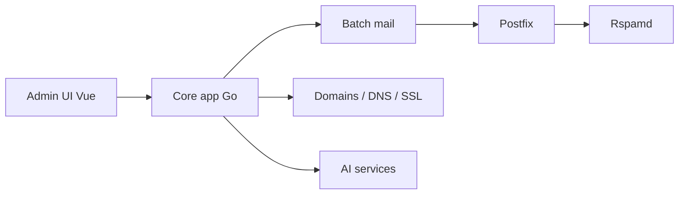

# Billionmail/BillionMail

> Serveur de courriel et plateforme d'emailing auto-hébergés ; doublon apparent du dépôt aaPanel/BillionMail.

## Le problème
Les plateformes d'emailing sont chères ou fermées, et un serveur mail se monte difficilement à la main.

## Ce que ça fait vraiment
Le README est identique à celui d'aaPanel/BillionMail (mêmes commandes qui clonent `aaPanel/BillionMail`). D'après le code : conteneurs Postfix, Dovecot, Rspamd et `core` (backend Go), interface d'administration Vue, envoi en lots, contacts, domaines/DNS/SSL, RBAC, journaux, fail2ban, un module d'IA (OpenAI, Anthropic, Gemini, DeepSeek…) et un module de génération vidéo.

## Comment c'est branché


## Essayer
```bash
cd /opt && git clone https://github.com/aaPanel/BillionMail && cd BillionMail && bash install.sh
bm help
```

## Coût et pièges
IP, DNS et réputation d'envoi à ta charge. Licence AGPL-3.0. Les clés des fournisseurs d'IA sont à fournir pour ces modules. Les commandes du README pointent vers le dépôt aaPanel, pas celui-ci.

## Ce que ce n'est pas
Ce n'est pas un projet distinct prouvé : la relation avec aaPanel/BillionMail n'est pas expliquée. Les modules IA et vidéo viennent du code, pas du README.

## Alternatives
Aucune alternative nommée. Le dépôt aaPanel/BillionMail est la source citée par les commandes.

## Pour toi
À surveiller : mêmes réserves que l'original ; commence par établir quel dépôt fait foi avant de l'évaluer.

