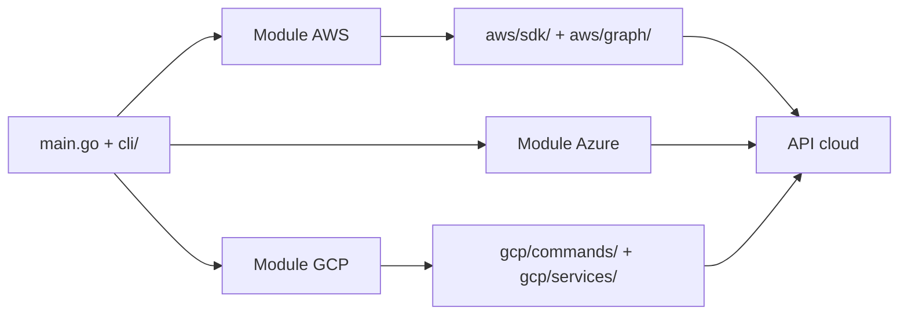

# BishopFox/cloudfox

> Outil en ligne de commande qui cartographie un environnement AWS, Azure ou GCP pour les auditeurs de sécurité mandatés.

## Le problème
Un test d'intrusion cloud démarre souvent dans un compte inconnu : quelles régions, quelles ressources, quels rôles, quels secrets exposés ? Tout relever à la main dans la console est long.

## Ce que ça fait vraiment
- Énumère en lecture les ressources d'un compte (instances, buckets, fonctions, secrets, rôles, endpoints) et écrit des tableaux et fichiers « loot ».
- Couvre AWS (le plus complet), GCP (une cinquantaine de commandes) et Azure (quelques commandes : whoami, inventory, rbac, storage, vms).
- Une commande `all-checks` enchaîne les commandes AWS avec des réglages par défaut.
- Ne produit ni alertes ni score de conformité : il fournit de la matière à l'auditeur, et évite volontairement l'exploitation automatisée.

## Comment c'est branché


## Essayer
```bash
brew install cloudfox
cloudfox aws --profile [profile-name] all-checks
```

## Coût et pièges
Gratuit, mais il faut des identifiants cloud avec des droits de lecture (politique `SecurityAudit` + politique CloudFox pour AWS ; `roles/viewer` et plus pour GCP). Les versions antérieures à 1.17.0 ne fonctionnent plus (changement de format AWS, 12/2025). N'utiliser que sur des comptes dont on a l'autorisation écrite.

## Ce que ce n'est pas
Ni un outil de conformité (voir ScoutSuite, Prowler), ni un framework d'exploitation. Les erreurs sont fréquentes si les droits manquent ; elles sont consignées dans `~/.cloudfox/cloudfox-error.log`. Azure reste peu couvert (README : storage « en développement »).

## Alternatives
- ScoutSuite / Prowler : benchmarks de conformité, si tu veux des constats plutôt que de l'énumération.
- Pacu : ajoute l'automatisation de l'exploitation, que CloudFox évite.
- Steampipe : requêter toutes ses ressources cloud en SQL, hors contexte offensif.

## Pour toi
Surveiller : utile si tu audites la surface d'un cloud (droits trop larges sur des rôles de pipelines ML, secrets en variables d'environnement), mais c'est un outil de pentest, pas de ton quotidien data/MLOps.

