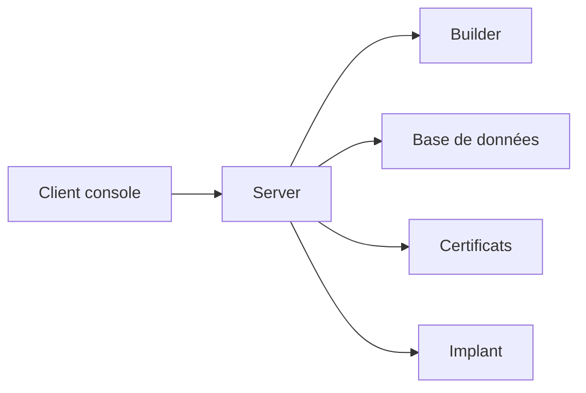

# BishopFox/sliver

> Framework multiplateforme d'émulation d'adversaire pour équipes rouges, utilisé lors de tests de sécurité autorisés.

## Le problème
Les organisations qui testent leurs défenses ont besoin d'un cadre reproduisant le comportement d'un adversaire, sous contrat, pour vérifier la détection et la réponse.

## Ce que ça fait vraiment
Une architecture serveur / client / implant : le serveur (RPC, base, certificats, générateur) est piloté par une console, en mode multijoueur. Les communications prennent en charge mTLS, WireGuard, HTTP(S) et DNS. Il tourne sous macOS, Windows et Linux, et se script en Python. Le README mentionne aussi un canari DNS pour la détection côté défense. Le détail des capacités offensives n'est pas repris ici.

## Comment c'est branché
Le README ne fournit pas de composants de graphe lisibles ; schéma d'après l'architecture décrite.


## Essayer
```bash
curl https://sliver.sh/install|sudo bash
sliver
```
Un script piped-to-shell est à relire avant exécution.

## Coût et pièges
Gratuit. Licence GPL-3.0 (copyleft). L'usage n'est licite que dans un cadre contractuel autorisé, sur des systèmes dont on a l'accord explicite. Le trafic peut déclencher des alertes de sécurité.

## Ce que ce n'est pas
Ce n'est pas un outil de data ou d'IA, ni un scanner de vulnérabilités. Ce n'est pas non plus un produit pour usage sans autorisation.

## Alternatives
Aucune alternative nommée dans le README.

## Pour toi
À ignorer pour un profil data / IA / MLOps : c'est un outil d'équipe rouge sans lien avec ton quotidien, et son usage exige un cadre légal strict.

