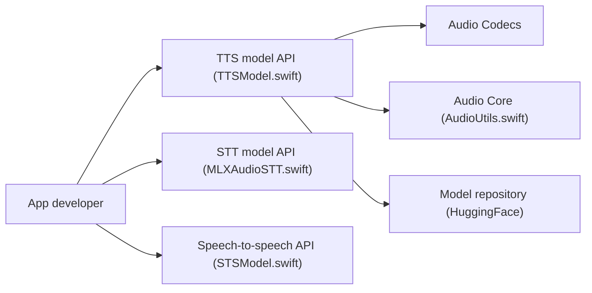

# Blaizzy/mlx-audio-swift

> SDK Swift modulaire pour synthèse vocale, transcription et traitement audio avec MLX sur Apple Silicon.

## Le problème
Faire tourner TTS, STT ou diarisation localement dans une app Apple demande de porter chaque modèle à la main.

## Ce que ça fait vraiment
Modules Swift à importer à la carte : MLXAudioCore, Codecs (SNAC, Encodec, Mimi…), TTS (Soprano, Qwen3-TTS, Orpheus, Fish Audio…), STT (Whisper, Parakeet, Qwen3-ASR…), VAD/diarisation (Sortformer, Silero), speech-to-speech et composants SwiftUI. Les modèles se téléchargent depuis HuggingFace ; génération asynchrone et streaming.

## Comment c'est branché


## Essayer
```bash
git clone https://github.com/Blaizzy/mlx-audio-swift.git
```
Le README ajoute la dépendance `.package(url: "https://github.com/Blaizzy/mlx-audio-swift.git", branch: "main")` dans Package.swift.

## Coût et pièges
macOS 14+ ou iOS 17+, Xcode 15+, Swift 5.9+, Apple Silicon recommandé. Dépendance sur la branche `main`, sans version figée.

## Ce que ce n'est pas
Pas de version Python ni Linux ; les tableaux de modèles listent parfois des checkpoints « compatibles » sans dépôt précis.

## Alternatives
- MLX Audio (Python) : le projet dont celui-ci s'inspire, pour un usage hors Swift.

## Pour toi
À surveiller si tu développes des apps audio locales sur Mac ou iOS ; sinon peu utile, car Swift et Apple Silicon uniquement.
