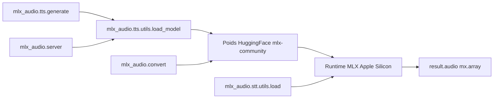

# Blaizzy/mlx-audio

> Bibliothèque audio sur MLX : TTS, STT, séparation et génération musicale sur Apple Silicon.

## Le problème
Faire tourner du TTS ou de l'ASR correct en local sur Mac suppose de convertir chaque modèle,
d'écrire son propre chargeur, et de recommencer pour le suivant.

## Ce que ça fait vraiment
Un point d'entrée unique, `load_model(...)` puis `generate(...)`, pour une trentaine
d'architectures : Kokoro, Qwen3-TTS, Higgs Audio, OmniVoice, Voxtral, MOSS-TTS côté synthèse ;
Whisper, Parakeet, Qwen3-ASR, VibeVoice-ASR côté transcription, avec diarisation et horodatage.
Aussi de la séparation de sources guidée par texte (SAM-Audio), du débruitage, de la VAD et de la
génération musicale. Quantification 3 à 8 bits par `mlx_audio.convert`. Serveur API compatible
OpenAI et interface web.

## Comment c'est branché


## Essayer
```bash
pip install mlx-audio
uv tool install --force mlx-audio --prerelease=allow
mlx_audio.tts.generate --model mlx-community/Qwen3-TTS-12Hz-0.6B-CustomVoice-8bit --text 'Hello, world!' --voice Vivian
mlx_audio.server --host 0.0.0.0 --port 8000
python -m mlx_audio.convert --hf-path prince-canuma/Kokoro-82M --mlx-path ./Kokoro-82M-4bit --quantize --q-bits 4
```

## Coût et pièges
Mac Apple Silicon obligatoire (M1 à M4), Python 3.10+. ffmpeg requis pour MP3/FLAC/OGG/Opus.
Certains modèles sont lourds : KugelAudio annonce ~17 Go de mémoire en bfloat16. Kokoro impose
`pip install misaki`, avec des extras par langue. Le README est tronqué avant la fin.

## Ce que ce n'est pas
Ce n'est pas portable : pas de CUDA, pas de Linux. Ce n'est pas un moteur d'entraînement.
KugelAudio n'a pas encore de presets de voix en amont — voix par défaut seulement.

## Alternatives
- **mlx-audio-swift** : pour du TTS embarqué iOS/macOS sans passer par Python.

## Pour toi
La référence si tu travailles l'audio en local sur Mac ; à adopter pour transcrire et synthétiser.
