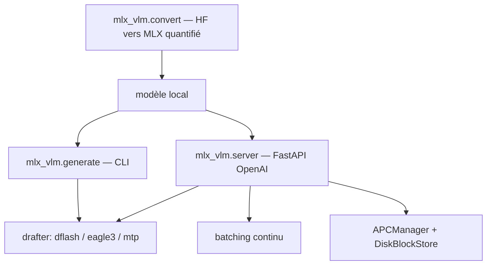

# Blaizzy/mlx-vlm

> Inférence et fine-tuning de modèles vision-langage et omni sur Mac, via MLX.

## Le problème
Faire tourner un VLM sur Apple Silicon suppose de convertir les poids, d'adapter le template de chat et de gérer le cache KV à la main.
Chaque nouvelle architecture recasse la chaîne.

## Ce que ça fait vraiment
Une CLI (`mlx_vlm.generate`), un serveur FastAPI compatible OpenAI et une API Python couvrent texte, image, audio, vidéo et génération de parole, avec plus de trente modèles documentés (DeepSeek-OCR, Gemma 4, MiniCPM-o, Qwen, MiniMax M3).
Le décodage spéculatif est industrialisé : trois familles de drafters (`dflash`, `eagle3`, `mtp`), auto-détection des checkpoints publiés, et des accélérations mesurées jusqu'à 3,94× sur Gemma 4 26B-A4B à sortie identique en greedy.
Le cache de préfixe automatique (APC) réutilise l'état entre requêtes partageant un préfixe, en mémoire chaude ou persisté sur disque en safetensors, avec un plan de cache par groupes de couches inspiré de vLLM.
Le serveur fait du batching continu, quantifie le cache KV (uniforme ou TurboQuant, bits séparés clés/valeurs) et journalise TTFT et débit.

## Comment c'est branché


## Essayer
```bash
pip install -U mlx-vlm
mlx_vlm.generate --model mlx-community/Qwen2-VL-2B-Instruct-4bit --max-tokens 100 --temperature 0.0 --image http://images.cocodataset.org/val2017/000000039769.jpg
mlx_vlm.server --port 8080 --model mlx-community/Qwen2.5-VL-3B-Instruct-4bit
curl http://localhost:8080/health
```

## Coût et pièges
Gratuit, mais réservé aux Mac Apple Silicon et gourmand en mémoire unifiée : le décodage spéculatif charge deux modèles à la fois.
Détails qui piègent : quoter `'mlx-vlm[ui]'` sous zsh, DSpark exige `temperature=0`, et le checkpoint MiniMax M3 BF16 annonce du MTP sans publier les tenseurs — il faut le drafter EAGLE-3.

## Ce que ce n'est pas
Ce n'est pas multiplateforme : MLX signifie Mac. Ce n'est pas non plus un serveur multi-modèles — un seul modèle est chargé à la fois, avec chargement/déchargement dynamique.
APC n'est pas gratuit en mémoire : le palier « warm memory » garde à la fois le pool de blocs et le `KVCache` d'exécution.

## Alternatives
- `mlx_lm` : cité, mais il ne connaît pas les types de modèles VL comme `minimax_m3_vl`.
- vLLM : la référence dont l'APC reprend le gestionnaire de cache hybride, côté GPU.

## Pour toi
Adopte-le si tu prototypes des VLM sur Mac : c'est la seule chaîne qui couvre conversion, serveur OpenAI, cache de préfixe et spéculatif.
