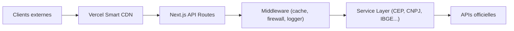

# BrasilAPI/BrasilAPI

> API REST publique et gratuite qui centralise des données publiques brésiliennes (CEP, CNPJ, banques…).

## Le problème
Des informations publiques comme un CEP ne sont pas accessibles depuis un navigateur : l'API des Correios n'active pas CORS.

## Ce que ça fait vraiment
Un projet Next.js déployé sur Vercel expose des routes API (v1, v2) et un endpoint GraphQL. Chaque service (banques, CEP, CNPJ, météo CPTEC, IBGE, FIPE, PIX, ISBN, Registro.br) appelle la source officielle. Une chaîne de middlewares gère cache, pare-feu, journal et erreurs. Le CDN de Vercel met les réponses en cache.

## Comment c'est branché

## Essayer
Aucune commande documentée dans le README : la documentation OpenAPI est indiquée en lien, et les endpoints sont appelés directement en HTTP.

## Coût et pièges
Gratuit, mais le README interdit le crawling automatisé : un opérateur télécom a déjà dépassé cinq fois le quota en revalidant tous les CEP. Le projet se dit en bêta, conditions d'usage pas encore rédigées.

## Ce que ce n'est pas
Pas une base à télécharger en masse ; pas un service garanti (aucun SLA). Les données restent celles des sources amont, aussi lentes ou instables qu'elles.

## Alternatives
Aucune alternative nommée dans le README.

## Pour toi
À surveiller : source pratique de données publiques brésiliennes pour un prototype, mais le quota de la maintenance et l'absence de conditions d'usage interdisent d'en faire une dépendance de pipeline.

