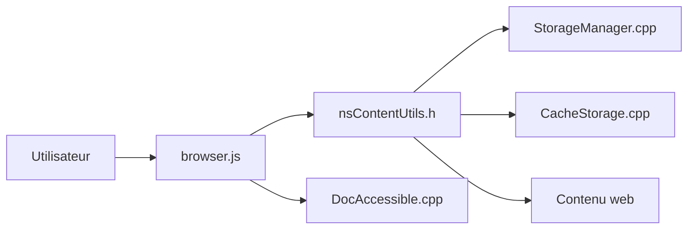

# BrowserWorks/waterfox

> Navigateur personnalisable dérivé de Mozilla Firefox, code source complet de la plateforme.

## Le problème
Les utilisateurs veulent un navigateur Firefox avec une personnalisation et un packaging propres, sans dépendre de la distribution officielle.

## Ce que ça fait vraiment
Le dépôt contient le code de la plateforme Mozilla, le code produit Waterfox, la marque, les fonctions, l'empaquetage et les fichiers de release. Le README ne documente que la compilation avec le système de build Mozilla (`./mach`). L'architecture décrite montre l'interface du navigateur, le DOM, le stockage, les médias et l'accessibilité.

## Comment c'est branché


## Essayer
```bash
./mach bootstrap
./mach build
./mach package
./mach test --auto
```

## Coût et pièges
Gratuit. Compiler Firefox exige beaucoup de disque, de RAM et de temps (non chiffré dans le README). La licence est présente mais non identifiée par GitHub : à vérifier.

## Ce que ce n'est pas
Pas une application légère à contribuer : c'est un fork de la plateforme Mozilla entière. Le README est très court et ne décrit ni fonctions ni différences avec Firefox.

## Alternatives
Firefox : base amont, documentée par les Firefox Source Docs.

## Pour toi
Ignorer : un navigateur n'apporte rien à un travail data/IA/MLOps, et le dépôt est énorme à compiler.

