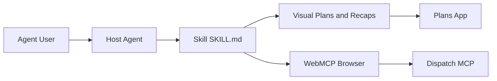

# BuilderIO/skills

> Catalogue de skills d'agent installables : plans visuels, revues de PR, garde-fous d'autonomie.

## Le problème
Les agents de code manquent de routines partagées pour planifier, relire, borner leur usage et vérifier leur travail.

## Ce que ça fait vraiment
Chaque skill est un `SKILL.md` invoqué par une commande (`/visual-plan`, `/visual-recap`, `/agent-watchdog`, `/plan-arbiter`, `/quick-recap`, `/stay-within-limits`…). Le module Factory, expérimental, transforme retours et télémétrie en changements sous politique. Plusieurs skills s'appuient sur des applications Agent-Native ou Clips Desktop.

## Comment c'est branché


## Essayer
```bash
npx @agent-native/skills@latest add
npx @agent-native/skills@latest add --skill quick-recap
/plugin marketplace add BuilderIO/skills
/plugin install builder-skills@builder-skills
```

## Coût et pièges
Gratuit, mais les plans partagés par lien passent par une appli hébergée ; un mode local existe. `/rewind` exige macOS et l'appli Clips Desktop. Création du dépôt en juin 2026 : jeune.

## Ce que ce n'est pas
Pas une bibliothèque de code : ce sont des instructions pour agents. Factory ne crée pas les intégrations ni les plannings.

## Alternatives
- skills de Vercel : `npx skills@latest add BuilderIO/skills`, copie simple des dossiers, sans les blocs `AGENTS.md`.

## Pour toi
À surveiller : quelques skills (`/read-the-damn-docs`, `/stay-within-limits`) valent d'être copiés dans ton flux avec Claude Code, le reste dépend d'un écosystème tiers.

