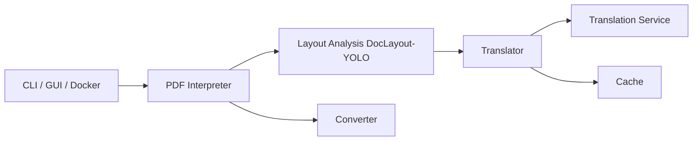

# Byaidu/PDFMathTranslate

> Traduit des PDF scientifiques en conservant formules, figures et mise en page, en CLI, GUI ou Docker.

## Le problème
Lire un article en langue étrangère sans perdre les équations ni le format d'origine.

## Ce que ça fait vraiment
`pdf2zh` analyse la mise en page avec DocLayout-YOLO (ONNX), traduit les paragraphes via un service au choix (Google par défaut, DeepL, OpenAI…) et réécrit le PDF, en produisant une version monolingue et une bilingue. Options : pages partielles, cache, mode MCP, backend BabelDOC, OCR expérimental. Le README indique que la version 2.0 vit dans un autre dépôt.

## Comment c'est branché


## Essayer
```bash
pip install uv
uv tool install --python 3.12 pdf2zh
pdf2zh document.pdf
pdf2zh -i
docker run -d -p 7860:7860 byaidu/pdf2zh
```

## Coût et pièges
Le service Google par défaut est sans clé ; les autres (OpenAI, DeepL) demandent une clé. Téléchargement d'un modèle depuis Hugging Face (miroir possible). Python 3.11 à 3.12 seulement.

## Ce que ce n'est pas
Pas le dépôt de la version 2.0 (PDFMathTranslate-next, réservé au développement). Les PDF sont envoyés au service de traduction choisi.

## Alternatives
- PDFMathTranslate-next : fork plus complet, non conçu pour les contributions.
- BabelDOC : backend expérimental cité.

## Pour toi
À adopter pour lire des papiers de recherche : installation en une commande, résultat immédiat, à condition d'accepter d'envoyer le texte à un service de traduction.
