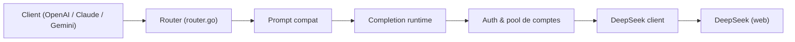

# CJackHwang/ds2api

> Passerelle Go qui expose l'interface web de DeepSeek comme API compatible OpenAI, Claude et Gemini.

## Le problème
Utiliser les modèles du chat web DeepSeek depuis des clients OpenAI, Anthropic ou Gemini sans passer par l'API officielle.

## Ce que ça fait vraiment
Un routeur Go traduit les requêtes des trois protocoles en contexte texte pour DeepSeek (couche PromptCompat), puis convertit les réponses en flux dans le format du client. Il gère un pool de comptes DeepSeek avec file d'attente, une preuve de travail (PoW) en Go pur, et la détection d'appels d'outils. Une console React `/admin` sert à la configuration. Sur Vercel, le flux passe par un relais Node.

## Comment c'est branché


## Essayer
```bash
cp config.example.json config.json
# éditer config.json (comptes DeepSeek, clés)
git clone https://github.com/CJackHwang/ds2api.git && cd ds2api
go run ./cmd/ds2api
```

## Coût et pièges
Fonctionne par ingénierie inverse, avec tes comptes DeepSeek : risque de blocage de compte ou de rupture sans préavis. Le dépôt est archivé (dernier push 2026-05-10).

## Ce que ce n'est pas
Pas un client officiel ni un service stable : le README exclut toute garantie et tout usage commercial sans accord. Licence AGPL-3.0.

## Alternatives
Aucune alternative nommée dans le README.

## Pour toi
À ignorer : dépôt archivé, fondé sur la rétro-ingénierie d'un service web (risque de ToS et de casse), et AGPL ; l'API officielle est plus sûre.
