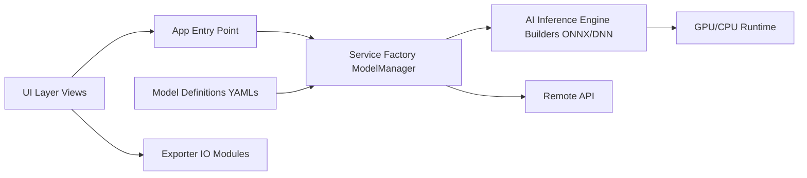

# CVHub520/X-AnyLabeling

> Application desktop d'annotation de données assistée par IA : images, vidéo, texte, nuages de points.

## Le problème
Annoter des datasets de vision à la main est lent ; brancher des modèles de pré-annotation dans un outil d'étiquetage demande du code.

## Ce que ça fait vraiment
Outils : polygones, boîtes, boîtes orientées, cuboïdes, masques, points, OCR/KIE, tags, baguette magique, nuages de points 3D.
Pré-annotation par modèles intégrés (YOLO, SAM 1/2/3, Grounding DINO, PP-OCR, Florence2, Qwen3-VL…).
Inférence locale (ONNX Runtime, TensorRT, OpenCV DNN) ou distante (vLLM, SGLang, X-AnyLabeling-Server).
Import/export COCO, VOC, YOLO, DOTA, MOT, PPOCR, ShareGPT ; Windows, Linux, macOS.

## Comment c'est branché

## Essayer
Aucune commande dans le README (renvoi vers la doc « Installation & Quickstart »).

## Coût et pièges
Gratuit, GPL-3.0 (attention en cas de redistribution modifiée). GPU conseillé pour les gros modèles ; VLM cloud (Gemini, ChatGPT) à ta charge. CLA pour contribuer.

## Ce que ce n'est pas
Pas une plateforme web collaborative multi-annotateurs : application desktop. Pas un outil d'entraînement (seul un exemple Ultralytics est fourni).

## Alternatives
Aucune nommée dans le README.

## Pour toi
À adopter pour tes projets de vision : pré-annotation SAM/YOLO/Grounding DINO et exports standards font gagner des jours sur la constitution d'un dataset.
