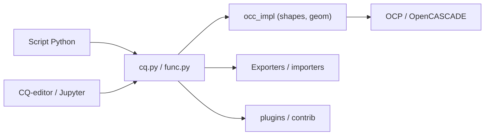

# CadQuery/cadquery

> Module Python pour décrire des modèles CAO 3D paramétriques par script, pour ingénieurs et développeurs.

## Le problème
La CAO en interface graphique se versionne et se paramètre mal ; un modèle scripté se relit, se teste et se régénère.

## Ce que ça fait vraiment
Une API Python de haut niveau (cq.py, func.py, fig.py, sketch, assemblages) pilote le noyau OpenCASCADE via les liaisons OCP. Exports STEP, DXF, STL, VRML, AMF, 3MF ; visualisation intégrée (trame et VTK), Jupyter, éditeur CQ-editor. Plugins et contributions en extension.

## Comment c'est branché


## Essayer
```bash
mamba install -c conda-forge cadquery
pip install cadquery
python3 -c "from cadquery.func import box, fillet; from cadquery.vis import show; b=box(1,1,1); show(fillet(b, b.edges('|Z'), 0.1))"
```

## Coût et pièges
Gratuit. Le README dit que l'installation conda est mieux prise en charge que pip ; pip est limité à Python 3.9 à 3.12 et à certaines distributions Linux. Licence « présente mais non identifiée » par GitHub : à lire.

## Ce que ce n'est pas
Pas un logiciel de CAO graphique : la bibliothèque est conçue sans interface. Pas un outil de simulation.

## Alternatives
Aucune alternative nommée dans le README (CQ-editor et OCP sont des compagnons, pas des concurrents).

## Pour toi
À surveiller : intéressant pour générer des géométries paramétriques dans un pipeline scripté, hors du cœur data/IA.

