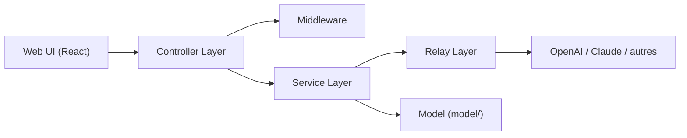

# Calcium-Ion/new-api

> Passerelle IA auto-hébergée qui unifie les API de modèles et gère routage, quotas et coûts pour équipes.

## Le problème
Chaque application configure ses fournisseurs (OpenAI, Anthropic, Gemini…) et personne ne suit qui consomme quoi.

## Ce que ça fait vraiment
Serveur Go (Gin) avec console React. Il expose les API OpenAI (chat, responses, embeddings, images, audio), Anthropic Messages et Gemini, convertit les protocoles (RelayKit) et route entre canaux avec priorités, poids et nouvelles tentatives. Gestion d'utilisateurs, groupes, clés, quotas, abonnements et journaux ; plugins JavaScript pour les tâches asynchrones. Base SQLite, MySQL ou PostgreSQL, Redis optionnel.

## Comment c'est branché


## Essayer
```bash
docker run --name new-api -d --restart unless-stopped \
  -p 127.0.0.1:3000:3000 \
  -e TZ=Asia/Shanghai \
  -v "$(pwd)/data:/data" \
  calciumion/new-api:latest
curl --fail-with-body http://localhost:3000/v1/models -H "Authorization: Bearer ${NEW_API_KEY}"
```

## Coût et pièges
Les clés amont et la facture des fournisseurs restent à ta charge. En production : HTTPS, `SESSION_SECRET` persistant, base partagée pour plusieurs nœuds ; épingler la version d'image. Le README rappelle des obligations légales si tu revends l'accès. Licence non renseignée au catalogue.

## Ce que ce n'est pas
Pas un fournisseur de modèles : il relaie ceux que tu abonnes. Les conversions de protocole ne mappent pas tous les champs.

## Alternatives
Le README cite One API, projet d'origine, et Midjourney-Proxy pour Midjourney.

## Pour toi
Adopter à l'essai si tu dois partager des accès LLM entre équipes avec suivi de coût ; vérifier d'abord la licence dans le dépôt.
