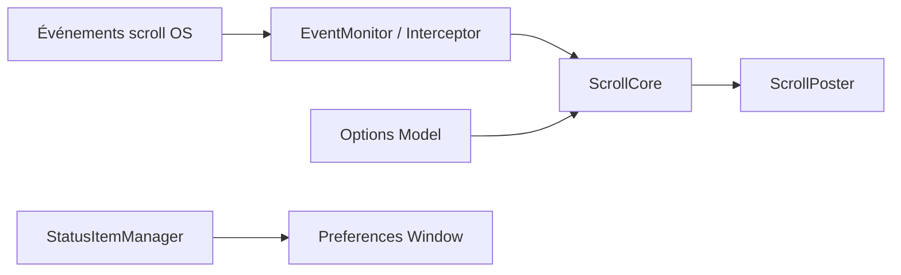

# Caldis/Mos

> Outil de barre de menus macOS qui lisse la molette de souris et remappe ses boutons.

## Le problème
Sur macOS, une molette classique défile par à-coups, faute de précision, contrairement à un trackpad.

## Ce que ça fait vraiment
Mos intercepte les événements de défilement, les interpole en scroll fluide et les réinjecte. Il règle pas, gain et durée, sépare l'axe vertical et l'horizontal, propose une configuration par application et lie des boutons de souris à des actions, des scripts ou des raccourcis. Il gère aussi les boutons des périphériques Logitech (HID++). Le README est en chinois.

## Comment c'est branché


## Essayer
```bash
brew install --cask mos
brew update
brew upgrade --cask mos
```

## Coût et pièges
Gratuit. macOS 10.13 ou plus ; la permission d'accessibilité est obligatoire pour lire et réécrire le scroll. Licence présente mais non identifiée par GitHub : à vérifier avant réutilisation. Le README refuse les gros PR générés par IA.

## Ce que ce n'est pas
Ce n'est ni multi-plateforme ni lié à la donnée. Les fichiers de traduction ne sont pas garantis relus.

## Alternatives
Aucune alternative citée dans le README (Smoothscroll-for-websites et Solaar sont crédités comme inspirations).

## Pour toi
Ignorer : confort de poste macOS sans lien avec le travail data / IA, avec une licence encore à clarifier.

