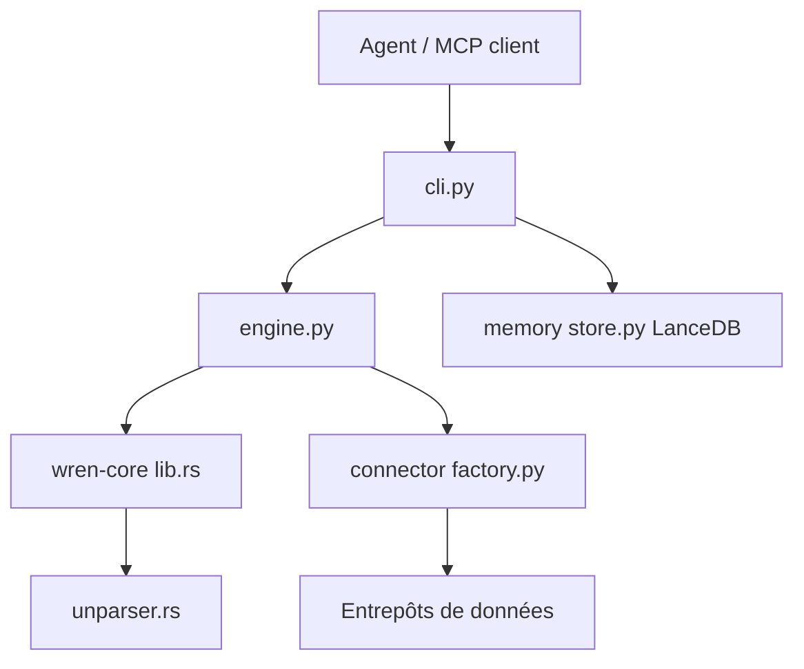

# Canner/WrenAI

> Couche sémantique versionnée qui permet à tes agents d'écrire du SQL gouverné et des tableaux de bord.

## Le problème
Un agent qui voit seulement le schéma ignore ce que « revenu net » veut dire et invente des jointures. Le SQL paraît juste mais il est faux.

## Ce que ça fait vraiment
Les définitions métier (modèles, métriques, jointures approuvées) s'écrivent en MDL, sous forme de YAML et Markdown versionnés dans Git.
Un moteur Rust/DataFusion transforme le SQL écrit sur ces concepts en SQL adapté à chacune des plus de 22 sources.
La CLI `wren` sert de serveur MCP, avec des skills et une mémoire LanceDB locale.
Les tableaux de bord générés se déploient sur ton compte Vercel ou Cloudflare.

## Comment c'est branché


## Essayer
```bash
pip install wrenai
npx skills add Canner/WrenAI
wren skills get onboarding
wren query --sql '...'
wren ask "<question>" --guided
```

## Coût et pièges
Le LLM vient de ton agent et reste à ta charge. La sécurité par ligne et par colonne, l'interface GenBI et les API sont payantes (Wren AI Cloud).

## Ce que ce n'est pas
Ce n'est pas une interface de chat BI : l'ancienne appli Docker est figée sur `legacy/v1`. C'est un modèle open core, et GitHub n'identifie pas la licence.

## Alternatives
Le README ne nomme aucun dépôt concurrent.

## Pour toi
À surveiller : le principe d'une couche sémantique dans Git pour le text-to-SQL par agents te concerne directement, mais le passage récent au modèle open core demande du recul.
