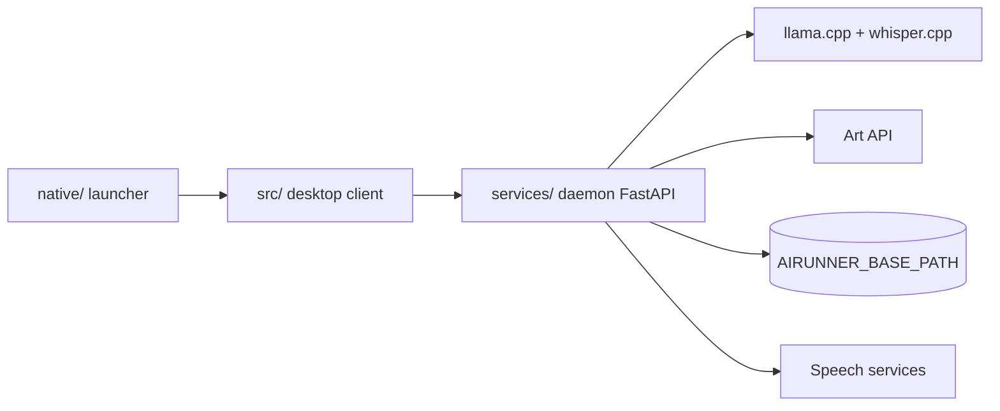

# Capsize-Games/airunner

> Application locale de compagnon IA et de génération d'images, avec serveur headless compatible OpenAI et Ollama.

## Le problème
Utiliser un LLM, la voix et la génération d'images en local demande d'assembler soi-même plusieurs moteurs et interfaces.

## Ce que ça fait vraiment
Une application de bureau (Qt) et un démon headless FastAPI. Compagnon nommé avec personnalité, voix (TTS, STT) et mémoire RAG ; canevas à calques avec SDXL et Z-Image Turbo. Le LLM local (Qwen3.5-9B GGUF par défaut) passe par un sidecar llama.cpp ; OpenRouter, OpenAI et Ollama sont possibles. Le serveur expose `/llm`, `/art`, `/tts`, `/stt`, plus des routes Ollama et OpenAI.

## Comment c'est branché


## Essayer
```bash
xhost +local:docker && docker compose run --rm airunner
docker compose run --rm --service-ports airunner --headless
airunner-headless --ollama-mode --model "/path/to/your/model"
```

## Coût et pièges
Gratuit, mais 16 Go de RAM minimum, GPU NVIDIA RTX 3060 minimum, 22 à 100 Go de disque, Python 3.13+. Les modèles se téléchargent depuis Hugging Face et CivitAI. Fonctions optionnelles vers des services externes (météo, DuckDuckGo, OpenRouter, OpenAI).

## Ce que ce n'est pas
Pas un produit à support commercial : un seul ingénieur le développe. Le filtre de contenu est inactif tant que le distributeur n'a pas généré sa liste (fichier de termes vide). Windows expérimental.

## Alternatives
Ollama, dont le mode compatible remplace le serveur pour des clients existants.

## Pour toi
À surveiller : serveur local d'inférence LLM et image unifié, intéressant en prototypage hors cloud, mais exigeant en matériel et porté par une seule personne.
