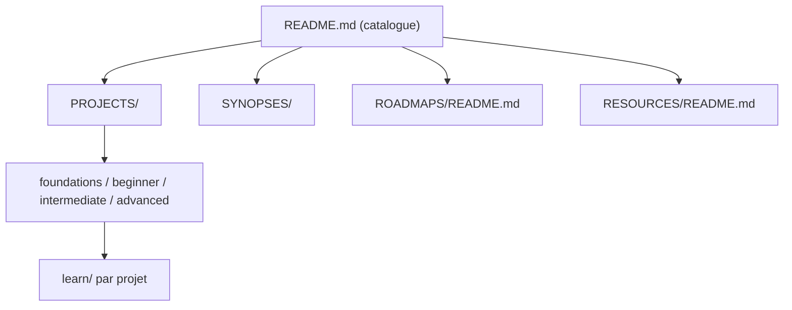

# CarterPerez-dev/Cybersecurity-Projects

> Monorepo pédagogique de projets de cybersécurité, classés en quatre niveaux, avec parcours et ressources.

## Le problème
Apprendre la sécurité par la pratique demande des exemples réalistes et gradués, dispersés sur le web.

## Ce que ça fait vraiment
- Quatre niveaux : Foundations (Python mono-fichier très commenté), Beginner, Intermediate, Advanced.
- Chaque projet est autonome (langage, dépendances, tests propres) avec un dossier `learn/` ; d'autres n'existent que comme synopsis.
- Domaines couverts : défense (SIEM, honeypots, détection par ML, scanners de secrets), analyse, cryptographie, et laboratoires pédagogiques sur des techniques offensives.
- Ajoute des feuilles de route de carrière et des ressources.

## Comment c'est branché

## Essayer
Aucune commande unique : chaque projet a son propre point d'entrée et sa documentation.

## Coût et pièges
Gratuit. Licence AGPL-3.0 : obligations de partage sur usage en service réseau. Le README renvoie vers la plateforme CertGames de l'auteur.

## Ce que ce n'est pas
Ce n'est pas une application unique ni un outil prêt pour la production. Les laboratoires offensifs sont à but éducatif : à exécuter en environnement isolé, sur des systèmes autorisés.

## Alternatives
Aucune nommée dans le README.

## Pour toi
Surveiller : bonne mine de références (détection ML, scanner de secrets, SBOM), à parcourir pour s'inspirer, pas à déployer tel quel.

