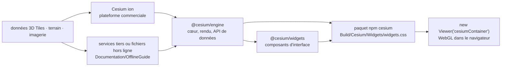

# CesiumGS/cesium

> **JavaScript engine for 3D globes and 2D maps in the browser, for large geospatial datasets.**

## The problem

Showing geospatial data in a browser hits two walls fast: a flat map projection stops being
enough as soon as you need terrain, buildings or a trajectory with altitude, and real datasets
(world terrain, point clouds, city models) are far larger than anything you can load in one go.
Without a dedicated engine you end up writing your own tiling, progressive loading and
globe-scale numeric precision — or falling back on a proprietary browser plugin.

## What it actually does

CesiumJS is a JavaScript library that draws a 3D globe and 2D maps in a web browser without a
plugin, using WebGL for hardware-accelerated graphics. The README describes it as
cross-platform, cross-browser and tuned for dynamic-data visualization, built on open formats
for interoperability and for scaling to massive datasets.

Three capabilities are listed under "Features": streaming 3D Tiles and other standard formats
from Cesium ion or another source, visualizing and analyzing on a high-precision WGS84 globe,
and sharing with users on desktop or mobile. The full list is deferred to a wiki page outside
the README.

The code is also distributed as scoped npm packages: `@cesium/engine` for the core, rendering
and data APIs, and `@cesium/widgets` for the widget library. The `cesium` package bundles both;
importing individual modules is recommended so bundlers can tree-shake. An offline guide, under
`Documentation/OfflineGuide/`, covers serving local data.

## How it is wired



No code-derived diagram exists for this repository: the graph above is reconstructed from the
README alone. The structuring point is the split between the engine, which lives in the repo,
and the 3D content, which does not: the README states that terrain, imagery and 3D Tiles come
either from the commercial Cesium ion platform or from other online or offline services, at the
user's choice.

## Try it

```sh
npm install cesium --save
```

```js
import { Viewer } from "cesium";
import "cesium/Build/Cesium/Widgets/widgets.css";

const viewer = new Viewer("cesiumContainer");
```

The README also offers a pre-built copy from the downloads page on the website, bypassing any
bundler, and points to an online quickstart guide for what comes next. No build-from-source
command is given in the README.

## Cost and traps

- **The library is free, the content may not be.** The README describes an open-core model: open
  source runtime engine, optional commercial subscription to Cesium ion for global 3D content
  (terrain, imagery, 3D Tiles) and for tiling, hosting and streaming your own data. That is the
  invoice line to anticipate, and the reason for the "depends on a SaaS" flag.
- **The ion dependency is not mandatory**: the README states you are free to use any combination
  of content sources, including offline ones, and documents serving local data. The price of that
  freedom is producing and serving your own tiles.
- **An account is required** for ion: the README links a signup page. Quotas and pricing are not
  documented in the README.
- **Client-side build chain**: the recommended path assumes a module bundler (Webpack, Parcel and
  Rollup are named) and importing the widgets CSS alongside the code — a common omission that
  yields an unstyled interface.
- **WebGL required**: rendering is hardware-accelerated, therefore dependent on the client GPU and
  driver. No minimum configuration is stated in the README.

## What it is not

- **Not a geospatial database or data catalog.** The repo holds the display engine; terrain,
  imagery and 3D Tiles live elsewhere, on Cesium ion or on your own infrastructure.
- **Not the Cesium ion platform.** The README clearly separates the Apache 2.0 open engine from
  the commercial platform; installing the npm package grants no access to hosted content.
- **Not a server-side renderer or image generator**: everything happens in the browser, in WebGL.
- **Not an analytical GIS.** The README advertises "visualize and analyze" on a WGS84 globe
  without detailing any spatial analysis operation; do not expect a geoprocessing toolbox.
- **Not 3D only** — 2D is advertised, but the README names no classic cartographic format it
  supports, deferring the list to an external wiki page.

## Alternatives

No comparable alternative in the catalog: the lexical neighbours offered
(`bilawalsidhu/gods-eye-view`, `gumyr/build123d`, `avelino/awesome-go`, `iptv-org/iptv`) are
respectively an imagery project, a Python parametric CAD library, a list of Go resources and a
directory of TV streams — none is a geospatial rendering engine for the browser. The README names
no competing project either, only the sibling packages of the same repo (`@cesium/engine`,
`@cesium/widgets`).

## For you

Worth watching rather than adopting by default: it only becomes relevant when 3D geospatial
display in a browser is part of the deliverable — trajectories, positioned sensors, model outputs
over a real footprint. In that case it is the reference, battle-tested and Apache 2.0, with good
interoperability through open formats. The decision to settle before committing is not the
library but where the content comes from: a Cesium ion subscription, or tiling and hosting at
your own expense. For a plain 2D map requirement, this is oversized.
