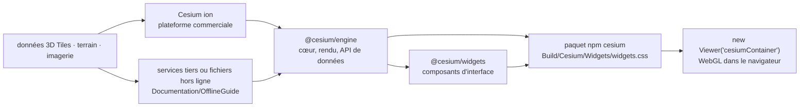

# CesiumGS/cesium

> **Moteur JavaScript de globe 3D et de carte 2D dans le navigateur, pour données géospatiales volumineuses.**

## Le problème

Afficher des données géospatiales dans un navigateur bute vite sur deux murs : la projection
d'une carte plate ne suffit plus dès qu'on veut du relief, des bâtiments ou une trajectoire en
altitude, et les jeux de données réels (terrain mondial, nuages de points, maquettes de ville)
dépassent de loin ce qu'on peut charger d'un coup. Sans moteur dédié, il faut écrire soi-même
le découpage en tuiles, le chargement progressif et la précision numérique à l'échelle du
globe — ou retomber sur un greffon propriétaire.

## Ce que ça fait vraiment

CesiumJS est une bibliothèque JavaScript qui dessine un globe 3D et des cartes 2D dans le
navigateur sans greffon, en s'appuyant sur WebGL pour l'accélération matérielle. Le README la
présente comme multiplateforme, multinavigateur et réglée pour la visualisation de données
dynamiques, bâtie sur des formats ouverts pour l'interopérabilité et le passage à l'échelle sur
de gros jeux de données.

Trois capacités sont annoncées dans la section « Features » : diffuser des 3D Tiles et d'autres
formats standards depuis Cesium ion ou une autre source, visualiser et analyser sur un globe
WGS84 de haute précision, et partager avec des utilisateurs sur poste de travail ou mobile. La
liste complète renvoie à une page de wiki, hors README.

Le code est aussi distribué en paquets npm à portée : `@cesium/engine` pour le cœur, le rendu et
les API de données, `@cesium/widgets` pour la bibliothèque de composants d'interface. Le paquet
`cesium` agrège les deux ; l'import module par module est recommandé pour profiter du *tree
shaking* des empaqueteurs. Un guide hors ligne, dans `Documentation/OfflineGuide/`, décrit le
service de données locales.

## Comment c'est branché



Aucun diagramme tiré du code n'existe pour ce dépôt : ce schéma est reconstruit depuis le seul
README. Le point structurant est la séparation entre le moteur, qui est dans le dépôt, et le
contenu 3D, qui n'y est pas : le README indique explicitement que le terrain, l'imagerie et les
3D Tiles viennent soit de la plateforme commerciale Cesium ion, soit d'autres services en ligne
ou hors ligne, au choix de l'utilisateur.

## Essayer

```sh
npm install cesium --save
```

```js
import { Viewer } from "cesium";
import "cesium/Build/Cesium/Widgets/widgets.css";

const viewer = new Viewer("cesiumContainer");
```

Le README propose aussi une copie précompilée à récupérer sur la page de téléchargements du
site, sans passer par un empaqueteur, et renvoie au guide de démarrage rapide en ligne pour la
suite. Aucune commande de compilation depuis les sources n'est donnée dans le README.

## Coût et pièges

- **La bibliothèque est gratuite, le contenu ne l'est pas forcément.** Le README décrit un
  modèle *open core* : moteur d'exécution ouvert, abonnement commercial facultatif à Cesium ion
  pour le contenu 3D mondial (terrain, imagerie, 3D Tiles) et pour le pavage, l'hébergement et la
  diffusion de ses propres données. C'est la ligne de facture à anticiper, et la raison de
  l'alerte « dépend d'un SaaS ».
- **La dépendance à ion n'est pas obligatoire** : le README affirme qu'on est libre d'utiliser
  n'importe quelle combinaison de sources, y compris des services hors ligne, et documente la
  diffusion de données locales. Le prix de cette liberté est qu'il faut alors produire et servir
  ses propres tuiles.
- **Un compte est nécessaire** pour ion : le README pointe une page d'inscription. Les quotas et
  tarifs ne sont pas documentés dans le README.
- **Chaîne de compilation côté client** : l'usage recommandé suppose un empaqueteur (Webpack,
  Parcel ou Rollup sont cités) et l'import du CSS des widgets en plus du code — un oubli fréquent
  qui donne une interface sans style.
- **WebGL requis** : le rendu est accéléré matériellement, donc dépendant du GPU et du pilote du
  poste client. Aucune configuration minimale n'est indiquée dans le README.

## Ce que ce n'est pas

- **Ce n'est pas une base de données ni un catalogue géospatial.** Le dépôt contient le moteur
  d'affichage ; les données de terrain, d'imagerie et de 3D Tiles sont ailleurs, chez Cesium ion
  ou chez soi.
- **Ce n'est pas la plateforme Cesium ion.** Le README distingue nettement le moteur ouvert sous
  Apache 2.0 de la plateforme commerciale ; installer le paquet npm ne donne aucun accès au
  contenu hébergé.
- **Ce n'est pas un outil de rendu côté serveur ni un générateur d'images** : tout se passe dans
  le navigateur, en WebGL.
- **Ce n'est pas un SIG d'analyse.** Le README annonce « visualiser et analyser » sur un globe
  WGS84, sans détailler d'opérations d'analyse spatiale ; ne pas attendre l'équivalent d'un outil
  de géotraitement.
- **Ce n'est pas seulement du 3D** : la 2D est annoncée, mais le README ne décrit aucun format
  cartographique classique pris en charge, la liste étant renvoyée à une page de wiki externe.

## Alternatives

Aucune alternative comparable dans le catalogue : les voisins proposés par le lexique
(`bilawalsidhu/gods-eye-view`, `gumyr/build123d`, `avelino/awesome-go`, `iptv-org/iptv`) relèvent
respectivement d'un projet d'imagerie, d'une bibliothèque de CAO paramétrique Python, d'une liste
de ressources Go et d'un annuaire de flux télévisés — aucun n'est un moteur de rendu géospatial
pour navigateur. Le README ne cite pas non plus de projet concurrent, seulement les paquets du
même dépôt (`@cesium/engine`, `@cesium/widgets`).

## Pour toi

À surveiller plutôt qu'à adopter par défaut : ça ne devient pertinent que si l'affichage
géospatial 3D dans le navigateur fait partie du livrable — visualisation de trajectoires, de
capteurs positionnés, de sorties de modèles sur une emprise réelle. Dans ce cas c'est la
référence, éprouvée et sous Apache 2.0, avec une bonne interopérabilité par les formats ouverts.
Le point à trancher avant de s'engager n'est pas la bibliothèque mais la provenance du contenu :
abonnement Cesium ion ou pavage et hébergement à sa charge. Pour un besoin de carte 2D simple,
c'est disproportionné.
