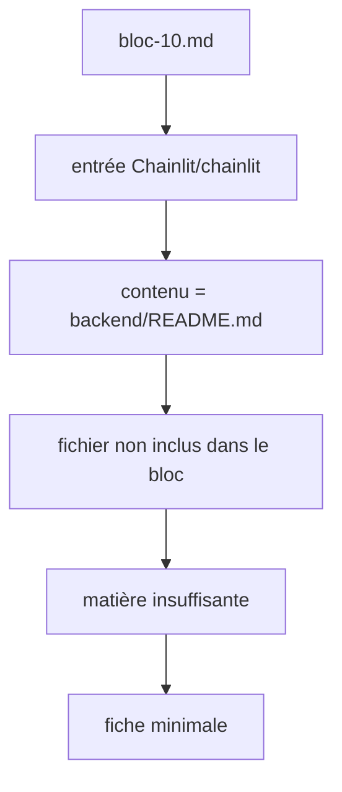

# Chainlit/chainlit

> Non documenté : le bloc ne contient aucun README exploitable pour ce dépôt.

## Le problème
Non documenté dans le bloc.
Le contenu fourni pour ce dépôt est la seule chaîne `backend/README.md`, soit un renvoi vers un fichier absent du bloc.

## Ce que ça fait vraiment
Non documenté. Aucune description, aucune fonctionnalité, aucune commande, aucun diagramme n'accompagne ce dépôt dans le bloc.
Les valeurs du front matter ci-dessus sont des défauts neutres, pas des constats : elles ne doivent pas être lues comme une caractérisation du projet.
Rien n'a été complété depuis une autre source, conformément à la règle « aucune invention ».
Il faut relancer l'extraction sur `backend/README.md` pour obtenir une fiche.

## Comment c'est branché

## Essayer
Aucune commande documentée.

## Coût et pièges
Non documenté. Ni clé d'API, ni GPU, ni Docker, ni quota ne sont mentionnés dans le bloc.
Le seul piège identifié est en amont : la collecte a récupéré un chemin de fichier au lieu du README.

## Ce que ce n'est pas
Ce n'est pas une fiche : c'est le constat d'une extraction manquée.
Ce n'est pas un dépôt évalué comme pauvre — la matière n'a simplement pas été fournie.
Ce n'est pas une raison de conclure quoi que ce soit sur le projet lui-même.

## Alternatives
Aucun dépôt nommé dans le contenu fourni.

## Pour toi
À reprendre : sans README, aucune décision possible.
