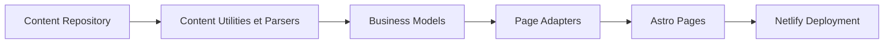

# Chalarangelo/30-seconds-of-code

> Articles courts avec extraits de code pour développeurs, consultables sur un site statique.

## Le problème
Retrouver rapidement un extrait de code fiable (JavaScript, CSS, HTML, Python, React) sans lire de longs tutoriels.

## Ce que ça fait vraiment
Le site se cherche par nom, tag, langage ou description ; chaque carte ouvre un article avec extrait, explication et exemples. Le dépôt contient le contenu (YAML et Markdown), des modèles, adaptateurs et sérialiseurs, et génère pages, flux RSS, sitemap et index de recherche avec Astro, déployé sur Netlify.

## Comment c'est branché

## Essayer
Aucune commande documentée dans le README : le contenu se lit sur le site.

## Coût et pièges
Gratuit. Le contenu de code est CC-BY-4.0, mais textes, images, code du site, logos et noms ne peuvent pas être réutilisés sans accord explicite de l'auteur : à lire avant toute reprise. Les contributions de contenu ne sont plus acceptées.

## Ce que ce n'est pas
Ce n'est pas une bibliothèque d'utilitaires importable. Le dépôt est le code d'un site plus qu'un package.

## Alternatives
Aucune alternative nommée dans le README.

## Pour toi
À ignorer : orienté front-end, contenu figé (aucune nouvelle contribution), et clauses de réutilisation ambiguës.

