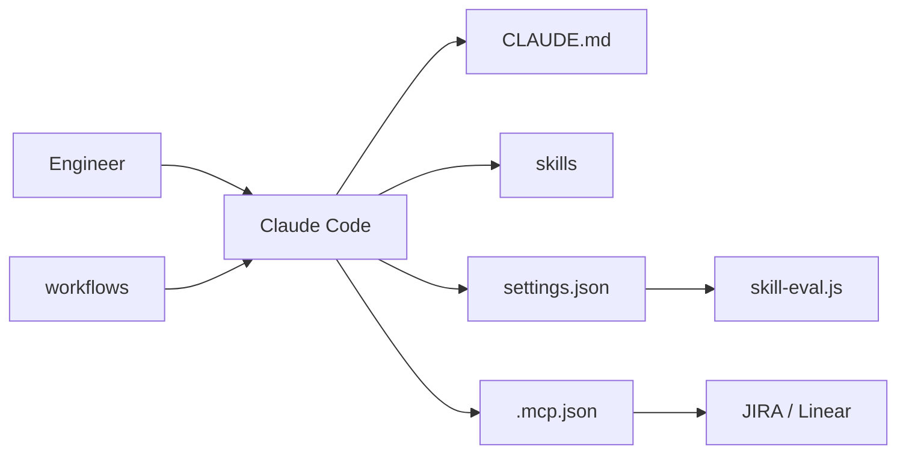

# ChrisWiles/claude-code-showcase

> Exemple complet de configuration `.claude/` : skills, agents, hooks, commandes et workflows GitHub.

## Le problème
La doc de Claude Code décrit chaque brique isolément ; on manque d'un projet qui montre comment tout s'assemble en équipe.

## Ce que ça fait vraiment
Fournit un `CLAUDE.md`, un `settings.json` avec hooks (blocage sur main, formatage, tests), des skills (tests, GraphQL, formulaires).
Un hook `UserPromptSubmit` qui score le prompt (mots-clés, chemins, intention) pour suggérer des skills.
Agents (revue de code), commandes (`/ticket` pour JIRA/Linear via MCP).
Workflows GitHub : revue de PR, synchro docs mensuelle, audit de dépendances.

## Comment c'est branché


## Essayer
```bash
mkdir -p .claude/{agents,commands,hooks,skills}
cp -r .claude/hooks/ your-project/.claude/hooks/
```

## Coût et pièges
Workflows planifiés facturés sur ta clé Anthropic : estimation du README 10 à 50 $/mois.

## Ce que ce n'est pas
Pas un outil installable : un modèle à copier et adapter. Aucune licence, donc réutilisation juridiquement floue ; certains noms de paquets MCP cités sont à vérifier.

## Alternatives
Aucune alternative nommée dans le README.

## Pour toi
À surveiller comme source d'idées (le hook de suggestion de skills est à reprendre), mais sans licence il faut s'en inspirer plutôt que copier.
