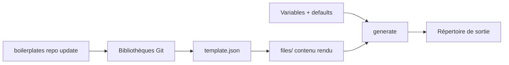

# ChristianLempa/boilerplates

> CLI qui transforme des templates d'infra (Docker, Terraform, Ansible) en fichiers configurés.

## Le problème
Les configs de homelab se recopient d'un projet à l'autre, avec les mêmes variables à changer à
la main, et personne ne sait plus quelle version fait foi.

## Ce que ça fait vraiment
Gère des bibliothèques de templates adossées à Git, locales ou distantes. Chaque template déclare
ses variables dans un `template.json` et son contenu sous `files/`, avec une syntaxe façon Jinja2
mais à délimiteurs maison. La CLI liste, inspecte, valide et génère, en mode interactif guidé ou
avec des `--var` en ligne de commande. Les valeurs récurrentes se figent en défauts par type.

## Comment c'est branché


## Essayer
```bash
curl -fsSL https://raw.githubusercontent.com/christianlempa/boilerplates/main/scripts/install.sh | bash
boilerplates repo update
boilerplates compose list
boilerplates compose generate authentik
boilerplates compose generate traefik --output my-proxy --var service_name=traefik --no-interactive
nix run github:christianlempa/boilerplates -- --help
```

## Coût et pièges
Gratuit, installé via `pipx` par le script. Rupture nette en `0.2.0` : les manifestes
`template.yaml`/`.yml` et les fichiers `.j2` ne sont plus supportés du tout. La validation des
kinds `python` et `bash` est volontairement minimale — ni compilation, ni test.

## Ce que ce n'est pas
Ce n'est pas un orchestrateur : il génère des fichiers, il ne déploie rien. Ce n'est pas la
bibliothèque de templates elle-même — les 100+ presets vivent dans `boilerplates-library`.

## Alternatives
- **boilerplates-library** : le dépôt compagnon, si tu ne veux que les presets sans la CLI.

## Pour toi
Confort de homelab ; peu d'intérêt si ton infra est déjà sous Terraform versionné.
