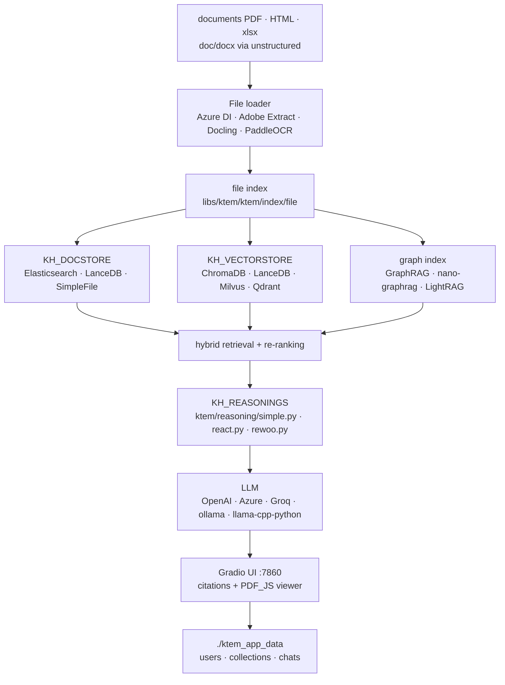

# Cinnamon/kotaemon

> **A self-hostable web UI for question answering over your documents, plus the RAG framework behind it.**

## The problem

Standing up an internal RAG demo takes a day; making it usable by non-developer colleagues
takes ten — accounts, private collections, source PDF preview, checkable citations, model
selection without editing code. Everyone rewrites that interface layer around their own
pipeline, and retrieval quality ends up being judged from terminal screenshots instead of
annotated answers.

## What it actually does

Kotaemon ships the whole application, not just the pipeline: a Gradio web server with
multi-user login, private or public file collections, chat sharing, and a settings tab where
most retrieval and generation parameters can be changed, prompts included.

The default pipeline is hybrid — full-text plus vector retrieval, then re-ranking. Answers
come with detailed citations including relevance scores, shown in an in-browser PDF viewer
with highlights, and a warning when retrieved passages score low. The README also lists
question decomposition and `ReAct` / `ReWOO` agent pipelines, declared in `flowsettings.py`.

Everything else is pluggable: document store (Elasticsearch, LanceDB, plain files), vector
store (ChromaDB, LanceDB, Milvus, Qdrant, in-memory), models from OpenAI, Azure, Cohere, Groq,
or local via `ollama` and `llama-cpp-python`. Graph indexing is not in-house: it is provided as
an example and delegated to GraphRAG, nano-graphrag or LightRAG. You extend it by dropping a
`.py` into `libs/ktem/ktem/reasoning/` and declaring it in `flowsettings.py`.

## How it is wired



No code-derived diagram ships with this repository: the graph above is rebuilt from the README
alone, reusing the file and variable names it cites (`flowsettings.py`, `KH_DOCSTORE`,
`KH_VECTORSTORE`, `KH_REASONINGS`, `ktem_app_data`).

## Trying it

```bash
docker run \
-e GRADIO_SERVER_NAME=0.0.0.0 \
-e GRADIO_SERVER_PORT=7860 \
-v ./ktem_app_data:/app/ktem_app_data \
-p 7860:7860 -it --rm \
ghcr.io/cinnamon/kotaemon:main-full
```

Then `http://localhost:7860/`. The README also offers `main-lite` (smaller, no `unstructured`)
and `main-ollama` (bundled local model), plus `--platform linux/arm64`. Without Docker:

```bash
git clone https://github.com/Cinnamon/kotaemon
cd kotaemon

uv sync --python 3.10
source .venv/bin/activate

python app.py
```

Default username and password are both `admin`. A conda path is documented as an alternative
(`pip install -e "libs/kotaemon[all]"` then `pip install -e "libs/ktem"`), and graph indexing is
added separately: `pip install nano-graphrag`, then launch with `USE_NANO_GRAPHRAG=true`.

## Cost and gotchas

- **The software is free, the models are not.** The default path uses `OPENAI_API_KEY` in a
  `.env` file (or Azure, Cohere, Groq): every indexed document and every question is billed by
  the provider. A local path exists — `ollama pull llama3.1:8b` plus `nomic-embed-text` — and it
  is what makes the install genuinely free.
- **RAM for local models**: the README advises picking a GGUF smaller than available memory
  with ~2 GB of headroom, and cites Qwen1.5-1.8B-Chat-GGUF at ~2 GB. No VRAM requirement is
  documented.
- **`.env` gotcha**: it only seeds the database on **first run**; afterwards it is ignored and
  configuration lives in the `Resources` tab. Fixing the file later changes nothing.
- **File formats**: beyond `.pdf`, `.html`, `.mhtml`, `.xlsx` you must install `unstructured`
  (or take the heavier `full` image). Serious multimodal parsing goes through Azure Document
  Intelligence or Adobe PDF Extract — two paid APIs — or locally through Docling / PaddleOCR.
- **Declared dependency conflicts**: the README warns that `nano-graphrag` and `LightRAG` break
  the install, and gives the workaround
  (`pip uninstall hnswlib chroma-hnswlib && pip install chroma-hnswlib`).
- **Microsoft's official GraphRAG** is pinned to `graphrag<=0.3.6`, works only with OpenAI or
  Ollama, and needs its own `GRAPHRAG_API_KEY`. The maintainers themselves recommend
  nano-graphrag instead.
- **PDF viewer**: in-browser highlighting is not bundled; you download `PDF_JS_DIST` and extract
  it into `libs/ktem/ktem/assets/prebuilt`.
- **All state lives in `./ktem_app_data`** — that folder is the backup, and nothing else is.

## What it is not

- **Not a component to import into an existing service.** What ships is a Gradio application
  with its users, database and settings tab. `import kotaemon` is supported and documented for
  developers, but you then inherit the `ktem` architecture; no HTTP question-answering API is
  documented in the README.
- **Not a GraphRAG engine.** Graph indexing is presented as an *example* of extensibility and
  rests entirely on third-party projects, with their version conflicts and provider
  restrictions. Judging kotaemon on that ground means judging nano-graphrag.
- **Not private RAG by default**: the nominal install sends documents and questions to a
  third-party API. Local mode is possible and documented, but it is an explicit choice, Docker
  image included.
- **Not finished on the extension side**: the custom indexing pipeline documentation carries a
  "more instruction WIP" note in the README.

## Alternatives

| | When to prefer it |
|---|---|
| **microsoft/graphrag** | Named in the README, and integrated by kotaemon as an index engine. Prefer it when graph construction itself is the object of study; prefer kotaemon when you want a UI, users and citations around it. |
| **langchain-ai/langchain** | Catalogue neighbour: a component library for writing your own pipeline. Prefer it when RAG must fit inside an application you write. Prefer kotaemon when the application *is* the deliverable. |
| **getzep/graphiti** | Catalogue neighbour: temporal graph memory for agents, not a document QA interface. Comparable only on the graph indexing part. |

`langchain-ai/langgraph` is not comparable: agent graph orchestration, with no document layer
and no UI.

## For you

Adopt it as a test bench rather than a dependency. It is the shortest path to putting an
evaluable RAG in front of business colleagues — scored citations, highlighted PDF, low-relevance
warning — which is to say, to getting feedback on *retrieval quality* instead of arguing about
architecture. The interface layer is the real contribution; the pipeline stays replaceable.
Skip it if the deliverable is a headless service: half the project would be dead weight.
