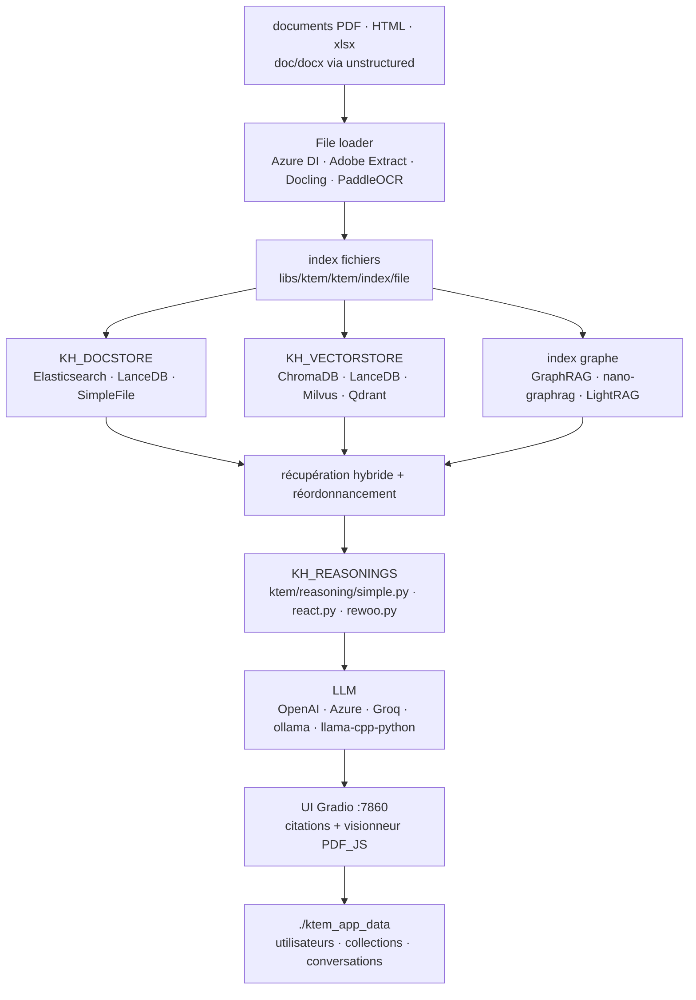

# Cinnamon/kotaemon

> **Une interface web de questions-réponses sur documents, auto-hébergeable, et le cadre RAG qui la fait tourner.**

## Le problème

Monter une démonstration de RAG interne prend une journée ; la rendre utilisable par des
collègues non développeurs en prend dix — comptes, collections privées, aperçu du PDF source,
citations vérifiables, choix du modèle sans toucher au code. Chacun réécrit cette couche
d'interface autour de son pipeline, et on finit par juger la qualité de la recherche sur des
copies d'écran de terminal plutôt que sur des réponses annotées.

## Ce que ça fait vraiment

Kotaemon livre l'application complète, pas seulement le pipeline : serveur web Gradio avec
connexion multi-utilisateurs, collections de fichiers privées ou publiques, partage de
conversations, et un onglet de réglages où l'on modifie la plupart des paramètres de
recherche et de génération, y compris les prompts.

Le pipeline par défaut est hybride — recherche plein texte et vectorielle, puis réordonnancement.
Les réponses sortent avec des citations détaillées, score de pertinence compris, affichées
dans un visionneur PDF intégré au navigateur avec surlignage, et une alerte quand les passages
retrouvés sont peu pertinents. Le README annonce aussi le raisonnement par décomposition de
question et des pipelines à agents `ReAct` et `ReWOO`, listés dans `flowsettings.py`.

Le reste est branchable : magasin de documents au choix (Elasticsearch, LanceDB, fichiers),
magasin de vecteurs au choix (ChromaDB, LanceDB, Milvus, Qdrant, mémoire), modèles chez OpenAI,
Azure, Cohere, Groq ou en local via `ollama` et `llama-cpp-python`. L'indexation par graphe
n'est pas maison : elle est fournie en exemple et déléguée à GraphRAG, nano-graphrag ou LightRAG.
On étend en ajoutant un `.py` dans `libs/ktem/ktem/reasoning/` puis en le déclarant dans
`flowsettings.py`.

## Comment c'est branché



Aucun diagramme tiré du code n'accompagne ce dépôt : ce schéma est reconstruit depuis le seul
README, en reprenant les noms de fichiers et de variables qu'il cite (`flowsettings.py`,
`KH_DOCSTORE`, `KH_VECTORSTORE`, `KH_REASONINGS`, `ktem_app_data`).

## Essayer

```bash
docker run \
-e GRADIO_SERVER_NAME=0.0.0.0 \
-e GRADIO_SERVER_PORT=7860 \
-v ./ktem_app_data:/app/ktem_app_data \
-p 7860:7860 -it --rm \
ghcr.io/cinnamon/kotaemon:main-full
```

Puis `http://localhost:7860/`. Le README propose aussi les images `main-lite` (plus petite,
sans `unstructured`) et `main-ollama` (modèle local embarqué), et l'option
`--platform linux/arm64`. Sans Docker :

```bash
git clone https://github.com/Cinnamon/kotaemon
cd kotaemon

uv sync --python 3.10
source .venv/bin/activate

python app.py
```

Identifiant et mot de passe par défaut : `admin` / `admin`. La voie conda est documentée en
alternative (`pip install -e "libs/kotaemon[all]"` puis `pip install -e "libs/ktem"`), et
l'indexation par graphe s'ajoute à part : `pip install nano-graphrag`, puis lancement avec
`USE_NANO_GRAPHRAG=true`.

## Coût et pièges

- **Le logiciel est gratuit, les modèles non.** Le chemin par défaut passe par `OPENAI_API_KEY`
  dans un `.env` (ou Azure, Cohere, Groq) : chaque question indexée et posée est facturée chez
  le fournisseur. La voie locale existe — `ollama pull llama3.1:8b` plus `nomic-embed-text` — et
  c'est elle qui rend l'installation réellement gratuite.
- **RAM pour le local** : le README conseille de choisir un GGUF plus petit que la mémoire
  disponible en laissant ~2 Go de marge, et donne l'exemple de Qwen1.5-1.8B-Chat-GGUF à ~2 Go.
  Aucune exigence de VRAM n'est documentée.
- **Piège du `.env`** : il ne sert qu'à peupler la base **au premier lancement** ; ensuite il est
  ignoré, et la configuration se modifie dans l'onglet `Resources`. Corriger le fichier après
  coup ne change rien.
- **Formats de fichiers** : hors `.pdf`, `.html`, `.mhtml`, `.xlsx`, il faut installer
  `unstructured` (ou prendre l'image `full`, plus lourde). L'analyse multimodale sérieuse passe
  par Azure Document Intelligence ou Adobe PDF Extract — deux API payantes — ou en local par
  Docling / PaddleOCR.
- **Conflits de dépendances déclarés** : le README avertit que `nano-graphrag` et `LightRAG`
  cassent l'installation et donne le contournement
  (`pip uninstall hnswlib chroma-hnswlib && pip install chroma-hnswlib`).
- **GraphRAG officiel de Microsoft** : épinglé à `graphrag<=0.3.6`, ne fonctionne qu'avec OpenAI
  ou Ollama, et demande sa propre variable `GRAPHRAG_API_KEY`. Les mainteneurs recommandent
  eux-mêmes nano-graphrag à la place.
- **Visionneur PDF** : le surlignage en navigateur n'est pas fourni, il faut télécharger
  `PDF_JS_DIST` et l'extraire dans `libs/ktem/ktem/assets/prebuilt`.
- **Toutes les données vivent dans `./ktem_app_data`** : c'est ce dossier qu'on sauvegarde, et
  rien d'autre.

## Ce que ce n'est pas

- **Ce n'est pas une brique à importer dans un service existant.** L'objet livré est une
  application Gradio avec ses utilisateurs, sa base et son onglet de réglages. `import kotaemon`
  est prévu et documenté pour les développeurs, mais on hérite alors de l'architecture de
  `ktem` ; il n'y a pas d'API HTTP de questions-réponses documentée dans le README.
- **Ce n'est pas un moteur GraphRAG.** L'indexation par graphe est présentée comme un *exemple*
  d'extensibilité et repose entièrement sur des projets tiers, avec leurs conflits de versions
  et leurs restrictions de fournisseur. Juger kotaemon sur ce terrain, c'est juger nano-graphrag.
- **Ce n'est pas du RAG privé par défaut** : l'installation nominale envoie documents et
  questions à une API tierce. Le mode local est possible et documenté, mais c'est un choix à
  faire explicitement, image Docker comprise.
- **Ce n'est pas un produit fini côté extension** : la documentation du pipeline d'indexation
  personnalisé porte la mention « more instruction WIP » dans le README.

## Alternatives

| | Quand le préférer |
|---|---|
| **microsoft/graphrag** | Nommé dans le README, et intégré par kotaemon comme moteur d'index. À préférer si l'objet de l'étude est la construction du graphe elle-même ; kotaemon à préférer si on veut une interface, des utilisateurs et des citations autour. |
| **langchain-ai/langchain** | Voisin du catalogue : bibliothèque de composants pour écrire son pipeline. À préférer quand le RAG doit s'insérer dans une application qu'on écrit soi-même. Kotaemon à préférer quand l'application *est* le livrable. |
| **getzep/graphiti** | Voisin du catalogue : mémoire en graphe temporel pour agents, pas une interface de questions-réponses documentaire. Comparable seulement sur la partie indexation par graphe. |

`langchain-ai/langgraph` n'est pas comparable : orchestration de graphes d'agents, sans
couche documentaire ni interface.

## Pour toi

À adopter comme banc d'essai plutôt que comme dépendance. C'est le chemin le plus court pour
mettre un RAG évaluable entre les mains de collègues métier — citations avec score, PDF
surligné, avertissement de faible pertinence — c'est-à-dire pour obtenir des retours sur la
*qualité de récupération* au lieu de discuter d'architecture. La couche interface est le vrai
apport ; le pipeline, lui, reste remplaçable. À ne pas choisir si le livrable est un service
sans écran : la moitié du projet serait du poids mort.
