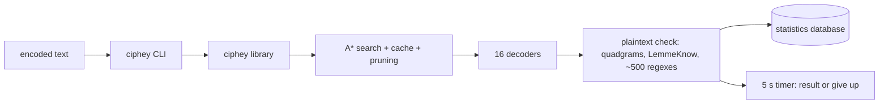

# Ciphey/Ciphey

> **A command-line automatic decoder for encoded or classically enciphered text, aimed at CTF work.**

## The problem

You are handed an unreadable string — base64, Rot13, Caesar, Vigenere, or all three stacked —
and no idea where to start. Trying decoders by hand is slow, and you never know when to give
up: the README says the earlier tool, Ciphey, "could run forever" without telling you it had
failed.

## What it actually does

The README stored for this repository is the one for `ciphey`, the Rust rewrite the same
authors announce as Ciphey's replacement. It takes a string and searches for a decoding path:
16 decoders today (against roughly 50 in Ciphey), including Braille, Atbash and Vigenere, and
it chains several levels (Rot13 -> Base64 -> Rot13). The search is A\*: very fast decoders such
as Base64 run first on every node, the rest are ranked by a heuristic from `cipher_identifier`,
with a cache of previous results, tree pruning to bound memory, per-decoder statistics that
dynamically reorder them, and prioritisation of common pairs. Plaintext is judged by a
quadgram / trigram / English dictionary check with a per-cipher sensitivity threshold (Low for
Caesar, Medium elsewhere), by LemmeKnow (the Rust port of PyWhat) for identifiers, by a
database of about 500 regexes for API keys and MAC addresses, and by an `is_password` lookup
against data dumps. A timer bounds the run: 5 seconds by default in the CLI, 10 in the Discord
bot. Multithreading uses Rayon; statistics are kept in a database.

## How it is wired



No code-derived diagram exists for this repository, so these nodes come from the README. The
split the README claims is two-part — a library and a CLI that is only a caller of it — which
is what lets `bee-san/discord-bot` build on the same engine. An optional BERT-based plaintext
detector, from the `gibberish-or-not` crate, plugs into the detection stage.

## Trying it

```bash
cargo install ciphey
ciphey
```

```bash
git clone <this repo>
docker build .
```

```bash
ciphey --enable-enhanced-detection
```

The README also offers a no-install route: join the Discord server, go to the `#bots` channel
and call `$ciphey`, with `$help` for guidance.

## Cost and gotchas

Free, no API key. Two real costs: `cargo install` assumes a Rust toolchain and compiles the
binary locally; the enhanced BERT detection needs a one-time 500 MB model download and a free
Hugging Face account. The 5-second timer is a deliberate limit — past it the tool stops, which
is the point, but a slow path will not be found. Coverage is 16 decoders against roughly 50 in
the older Ciphey, growing per the README. No licence is stated anywhere in the README. The
README also says the TUI is entirely AI-generated.

## What it is not

It is not cryptanalysis: it recognises and unstacks encodings and classical ciphers, it does
not break modern keyed encryption. It is also not the maintained repository — the README
states the intent to replace Ciphey with the Rust `ciphey`, so this repo is the one being left
behind. Nor is it yet a full functional replacement, since it covers fewer decoders than what
it supersedes. Finally, the install-free route runs through a third-party Discord server, so
the text you want decoded travels there.

## Alternatives

- `ciphey/ciphey` (the Python original): more decoders (~50), but slow and unbounded in time —
  the README frames it as the thing being left.
- `bee-san/pyWhat` / `swanandx/lemmeknow`: if you only need to *identify* a string (IP, API
  key, hash) rather than decode it, these two suffice, the latter in Rust.
- `bee-san/discord-bot`: the same engine exposed as a bot, if you want to install nothing.

## Why it matters to you

Limited day-to-day value for a data / MLOps profile: this is a CTF and light forensics tool.
Two things worth keeping, though — the ~500-regex identifier database and `is_password` are
reusable for secret scanning in logs or datasets, and the library is separate from the CLI so
it can be embedded. Watch rather than adopt, all the more since this particular repository is
the one being abandoned in favour of the Rust version.
