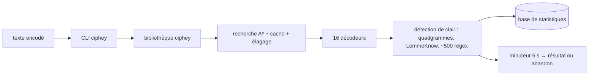

# Ciphey/Ciphey

> **Un décodeur automatique de texte chiffré ou encodé, en ligne de commande, pour du CTF.**

## Le problème

On tombe sur une chaîne illisible — base64, Rot13, César, Vigenère, ou un empilement des
trois — et on ne sait pas par quel bout la prendre. Essayer les décodeurs un par un à la main
coûte du temps, et rien ne dit quand s'arrêter : l'outil précédent, Ciphey, « pouvait tourner
indéfiniment » sans jamais annoncer son échec.

## Ce que ça fait vraiment

Le README de ce dépôt est celui de `ciphey`, la réécriture en Rust annoncée comme le
remplaçant de Ciphey par les mêmes auteurs. L'outil prend un texte et cherche un chemin de
décodage : il gère aujourd'hui 16 décodeurs (contre ~50 pour Ciphey), dont Braille, Atbash et
Vigenère, et sait enchaîner plusieurs niveaux (Rot13 → Base64 → Rot13). La recherche est une
recherche A\* : les décodeurs rapides comme Base64 passent d'office en premier, le reste est
ordonné par une heuristique issue de `cipher_identifier`, avec cache des résultats, élagage de
l'arbre, statistiques sur les décodeurs qui marchent et priorisation des paires fréquentes.
Pour décider si le résultat est du texte clair, il combine un test quadgramme / trigramme /
dictionnaire anglais, un seuil de sensibilité réglable selon le chiffre (Low pour César,
Medium par défaut ailleurs), la reconnaissance d'identifiants via LemmeKnow (version Rust de
PyWhat), une base d'environ 500 regex (clés d'API, adresses MAC) et une fonction
`is_password`. Un minuteur borne l'exécution : 5 secondes par défaut en CLI, 10 pour le bot
Discord. Le multithreading passe par Rayon. Les statistiques sont stockées en base.

## Comment c'est branché



Aucun diagramme tiré du code n'existe pour ce dépôt : ces nœuds viennent du README. Le
découpage annoncé est en deux morceaux, la bibliothèque et la CLI, la seconde n'étant qu'un
usage de la première — c'est ce qui permet au bot Discord `bee-san/discord-bot` de s'appuyer
dessus. Une détection de clair renforcée par un modèle BERT (crate `gibberish-or-not`) peut
s'ajouter au maillon de détection.

## Essayer

```bash
cargo install ciphey
ciphey
```

```bash
git clone <ce dépôt>
docker build .
```

```bash
ciphey --enable-enhanced-detection
```

Le README indique aussi un usage sans installation : rejoindre le serveur Discord, aller dans
le canal `#bots` et appeler `$ciphey`, `$help` pour l'aide.

## Coût et pièges

L'outil est gratuit et n'exige pas de clé d'API. Deux coûts réels : `cargo install` suppose
une chaîne Rust en place et compile la binaire chez toi ; la détection renforcée par BERT
demande un téléchargement unique de 500 Mo de modèle et un compte Hugging Face gratuit. Le
minuteur de 5 secondes est une limite assumée : au-delà, l'outil abandonne, ce qui est le
comportement recherché mais signifie qu'un chiffrement lent ne sera pas trouvé. La couverture
reste à 16 décodeurs contre ~50 dans l'ancien Ciphey — le README dit que ça grandit. Aucune
licence n'est mentionnée dans le README. Le README indique par ailleurs que la TUI est
entièrement générée par IA.

## Ce que ce n'est pas

Ce n'est pas un outil de cryptanalyse : il reconnaît et empile des encodages et des chiffres
classiques, il ne casse pas du chiffrement moderne à clé. Ce n'est pas non plus le dépôt
maintenu : le README annonce explicitement l'intention de remplacer Ciphey par la réécriture
Rust `ciphey` de bee-san — pointer ce dépôt revient à pointer un projet en fin de vie. Et ce
n'est pas un remplaçant fonctionnel complet en l'état, puisqu'il couvre moins de décodeurs que
ce qu'il remplace. Enfin, le mode « sans installation » passe par un serveur Discord tiers :
le texte à décoder y transite.

## Alternatives

- `ciphey/ciphey` (l'ancien, Python) : plus de décodeurs (~50), mais lent et sans borne de
  temps — le README le présente comme celui qu'on quitte.
- `bee-san/pyWhat` / `swanandx/lemmeknow` : si tu veux seulement *identifier* une chaîne (IP,
  clé d'API, hash) sans chercher à la décoder, ces deux-là suffisent, le second en Rust.
- `bee-san/discord-bot` : le même moteur exposé en bot, si tu ne veux rien installer.

## Pour toi

Intérêt limité côté data / MLOps au quotidien : c'est un outil de CTF et de forensic léger.
Deux choses à retenir quand même — la base d'environ 500 regex d'identifiants et `is_password`
sont réutilisables pour du scan de secrets dans des logs ou des jeux de données, et la
bibliothèque est séparée de la CLI donc intégrable. À surveiller plutôt qu'à adopter, d'autant
que ce dépôt-ci est celui qu'on abandonne au profit de la version Rust.
