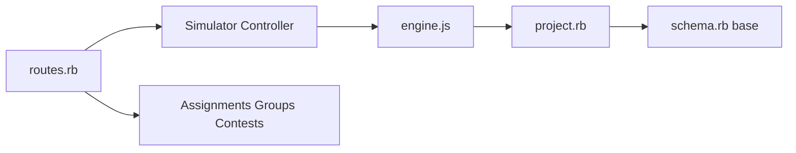

# CircuitVerse/CircuitVerse

> Plateforme web libre pour construire et simuler des circuits logiques, avec un livre interactif.

## Le problème
Apprendre les circuits numériques demande un simulateur accessible dans le navigateur et partageable en classe.

## Ce que ça fait vraiment
Application Rails : simulateur JavaScript, projets sauvegardés et partageables, recherche, groupes, devoirs, commentaires, concours, notifications. Un service Yosys et des notifications Slack complètent l'ensemble. Le README renvoie vers `SETUP.md`, une vidéo de démarrage et BrowserStack.

## Comment c'est branché

## Essayer
Aucune commande dans le README ; voir `SETUP.md` (non fourni ici).

## Coût et pièges
Installation non détaillée dans le README ; la vidéo évoque GitHub Codespaces. 987 issues ouvertes.

## Ce que ce n'est pas
Pas un outil de conception de puces professionnel : c'est un outil pédagogique.

## Alternatives
Aucune alternative nommée dans le README.

## Pour toi
Ignorer : éducation en électronique numérique, sans lien avec un flux data, IA ou MLOps.

