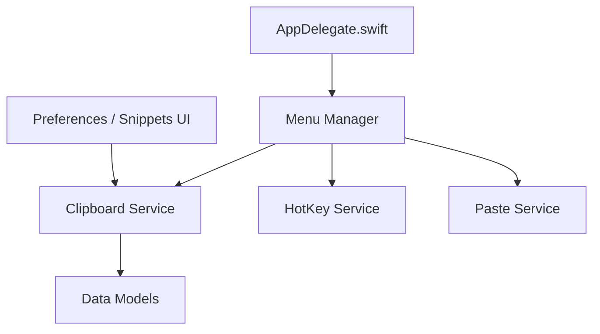

# Clipy/Clipy

> Extension de presse-papiers pour macOS, avec historique et extraits de texte, pour utilisateurs de Mac.

## Le problème
Le presse-papiers macOS ne garde qu'un seul élément ; retrouver un texte copié plus tôt est impossible.

## Ce que ça fait vraiment
Application de barre de menus en Swift : historique du presse-papiers, éditeur d'extraits (snippets), raccourcis clavier, collage automatique via l'accessibilité, préférences localisées. D'après l'architecture décrite, des services séparés gèrent le presse-papiers, les raccourcis, l'accessibilité, le collage et le nettoyage des données. Nécessite macOS 13 ou plus.

## Comment c'est branché

## Essayer
Le README ne donne pas de commande utilisable directement. Pour compiler : ouvrir `Clipy.xcodeproj`, décommenter l'inclusion de `CodeSigning-AdHoc.xcconfig` dans `Configurations/CodeSigning.xcconfig`, puis construire le schéma `Clipy`.

## Coût et pièges
Gratuit. Le certificat de signature par défaut est réservé au mainteneur : il faut passer en signature ad hoc, et macOS redemande l'accès Accessibilité à chaque build. Le fichier PRIVACY.md évoque analyses et rapports de plantage (Firebase optionnel).

## Ce que ce n'est pas
Pas un gestionnaire multi-plateformes ni synchronisé : usage local sur Mac. Le nom Clipy ne doit pas servir aux œuvres dérivées.

## Alternatives
Aucune alternative nommée dans le README.

## Pour toi
À ignorer pour le métier : utilitaire de confort macOS, sans lien avec la data ou l'IA, avec une télémétrie à examiner.

