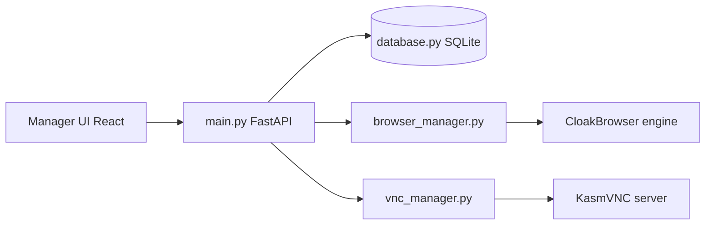

# CloakHQ/CloakBrowser-Manager

> Gestionnaire auto-hébergé de profils de navigateur isolés, chacun avec son empreinte, son proxy et ses cookies.

## Le problème
Gérer plusieurs comptes ou identités de navigation sans que cookies, empreinte et réseau se mélangent, sans passer par un service cloud à abonnement par profil.

## Ce que ça fait vraiment
- Crée des profils persistants : graine d'empreinte, GPU, écran, fuseau, langue, proxy propres à chacun.
- Fenêtres natives sous Windows/macOS ; sous Linux, Docker avec affichage KasmVNC.
- Chaque profil expose un point CDP pour Playwright ou Puppeteer.
- Le moteur (CloakBrowser, Chromium modifié) est téléchargé au premier lancement ; l'interface est déclarée MIT, mais la licence du dépôt n'est pas identifiée.

## Comment c'est branché


## Essayer
```bash
docker run -p 127.0.0.1:8080:8080 -v cloakprofiles:/data cloakhq/cloakbrowser-manager
# ou
git clone https://github.com/CloakHQ/CloakBrowser-Manager.git
cd CloakBrowser-Manager
docker compose up --build
```

## Coût et pièges
Gratuit avec un navigateur simultané ; au-delà, licence payante (clé `CLOAKBROWSER_LICENSE_KEY`). Environ 512 Mo de RAM par profil. Sans `AUTH_TOKEN`, aucune authentification, et le jeton circule en clair en HTTP. Projet en alpha précoce, installateurs non signés.

## Ce que ce n'est pas
Ce n'est pas un outil neutre : sa finalité déclarée est de rendre des identités indiscernables des sites qui les contrôlent, ce qui peut enfreindre leurs conditions d'utilisation. Ce n'est pas entièrement libre : le moteur est un binaire distinct sous licence commerciale.

## Alternatives
Le README cite comme références commerciales Multilogin, GoLogin et AdsPower (services cloud).

## Pour toi
À ignorer : peu de rapport avec un travail data/IA/MLOps courant, licence non identifiée, moteur propriétaire et usage qui prête à risque juridique.
