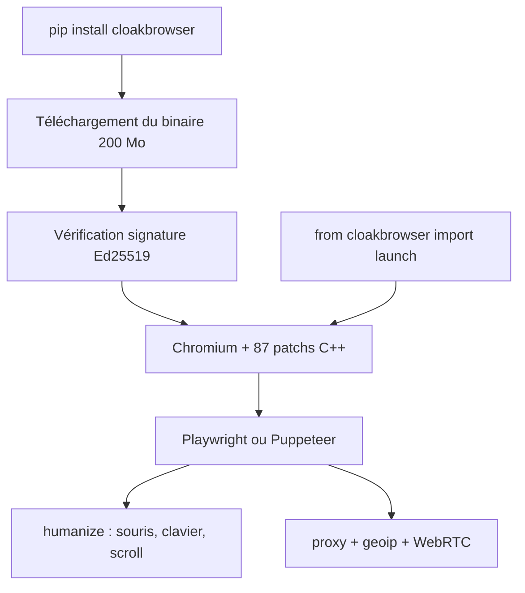

# CloakHQ/CloakBrowser

> Chromium modifié au niveau C++ pour ne pas être détecté comme automatisé, API Playwright inchangée.

## Le problème
Les outils de furtivité existants injectent du JavaScript ou changent des drapeaux, et cassent à chaque mise à jour de Chrome.
Les systèmes anti-bot détectent alors les correctifs eux-mêmes.

## Ce que ça fait vraiment
Fournit un binaire Chromium compilé avec 87 correctifs au niveau des sources C++ : canvas, WebGL, audio, polices, GPU, écran, WebRTC, timings réseau, signaux d'automatisation, comportement d'entrée CDP.
Se substitue à Playwright ou Puppeteer en changeant l'import : `launch()`, `launch_context()`, `launch_persistent_context()` renvoient des objets Playwright standard.
`humanize=True` remplace clics, frappes et défilements par des équivalents à courbes de Bézier et timings variables ; `geoip=True` aligne fuseau et locale sur l'IP de sortie du proxy et injecte l'usurpation d'IP WebRTC.
Profils persistants (cookies, localStorage, extensions Chrome, Widevine sous Linux), proxies HTTP et SOCKS5 natifs, binaire vérifié par signature Ed25519 avant extraction.

## Comment c'est branché


## Essayer
```bash
docker run --rm cloakhq/cloakbrowser cloaktest
pip install cloakbrowser
cloakbrowser login
python -m cloakbrowser info
```

## Coût et pièges
Le binaire v146 reste gratuit sur GitHub Releases ; la dernière version demande une connexion GitHub (une session concurrente) et l'usage à l'échelle est payant (5 à 2 000+ sessions).
Les proxys résidentiels ne sont pas fournis : facture séparée. `geoip=True` déclenche des appels HTTP via votre proxy vers ipify.org et checkip.amazonaws.com.

## Ce que ce n'est pas
Ce n'est pas un solveur de CAPTCHA : le projet vise à éviter qu'ils apparaissent, pas à les résoudre.
Ce n'est pas une rotation de proxys : vous apportez les vôtres.
Ce n'est pas neutre juridiquement : contourner des protections anti-bot engage votre responsabilité vis-à-vis des CGU des sites visés, et l'ancienne version gratuite se dégrade à mesure que la détection évolue.

## Alternatives
- playwright-stealth — injection JavaScript ; le README la dit obsolète et détectable.
- undetected-chromedriver — correctifs de configuration sur Selenium, sans API Playwright.
- puppeteer-extra — même famille d'approche par injection.

## Pour toi
Hors périmètre data/IA et juridiquement risqué : à ignorer, sauf mandat explicite de test anti-bot.
