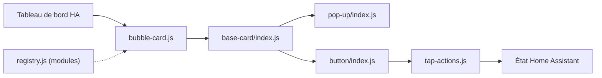

# Clooos/Bubble-Card

> Collection de cartes et pop-ups personnalisables pour les tableaux de bord Home Assistant.

## Le problème
Les tableaux de bord Home Assistant par défaut s'encombrent vite sur mobile, sans pop-ups ni contrôles compacts faciles à styler.

## Ce que ça fait vraiment
Un élément `custom:bubble-card` décliné en `card_type` : button (switch, slider, state, name), pop-up, horizontal-buttons-stack, media-player, climate, cover, calendar, select, separator.
Pop-ups ouvertes par hash d'URL (`#kitchen`) ou déclenchées par l'état d'une entité ; depuis la v3.2.0, contenu défini dans la pop-up (`cards`).
Style par variables CSS globales ou par carte ; éditeur visuel dans Home Assistant ; traductions.
Module Store intégré : plus de 100 modules de la communauté.

## Comment c'est branché


## Essayer
```bash
# Aucune commande shell dans le README.
# Installation via HACS (rechercher « Bubble Card »),
# ou copie de bubble-card.js dans /www puis ressource /local/bubble-card.js?v=1
```

## Coût et pièges
Gratuit ; il faut Home Assistant 2023.9.0 ou plus récent. Sans HACS, chaque mise à jour oblige à changer la version dans l'URL de la ressource, et parfois à vider le cache du navigateur.

## Ce que ce n'est pas
Pas une intégration domotique : ne pilote aucun appareil lui-même, il affiche et appelle les services de Home Assistant.
L'horizontal-buttons-stack doit être la dernière carte de la vue, hors de toute pile.
README tronqué après les options media-player.

## Alternatives
Aucune alternative nommée dans le README.

## Pour toi
Hors sujet data/IA : à ignorer, sauf pour ta domotique perso.
