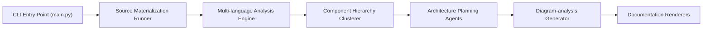

# CodeBoarding/CodeBoarding

> Génère des diagrammes d'architecture et de la documentation d'un dépôt par analyse statique et LLM.

## Le problème
Comprendre un grand dépôt, ou contrôler ce que produisent les agents de code, sans relire tout le code.

## Ce que ça fait vraiment
Les serveurs de langage (LSP) construisent des graphes d'appels ; un clusterer propose une hiérarchie de composants ; des agents LLM la nomment et la documentent. Sorties `.codeboarding/analysis.json` puis Markdown, HTML, MDX ou reST avec Mermaid. Modes `full`, `incremental`, `partial`. Extension VS Code, GitHub Action, plateforme web.

## Comment c'est branché


## Essayer
```bash
pipx install codeboarding --python python3.12
codeboarding-setup
codeboarding full --local /path/to/repo
codeboarding full --local /path/to/repo --render md
```

## Coût et pièges
Clé d'un fournisseur LLM (OpenAI, Anthropic, Google, Ollama, LiteLLM…) à ta charge ; Python 3.12 ou 3.13. Télécharge des serveurs de langage (et un Node si absent). Télémétrie activée par défaut (`CODEBOARDING_TELEMETRY=false`).

## Ce que ce n'est pas
Pas un relevé exact du code : les noms et regroupements viennent d'un LLM. Le coût en jetons croît avec la taille du dépôt.

## Alternatives
Aucune alternative nommée dans le README.

## Pour toi
À surveiller : pratique pour onboarder sur un dépôt inconnu ou documenter du code généré, à tester d'abord sur un petit dépôt pour mesurer le coût en jetons.
