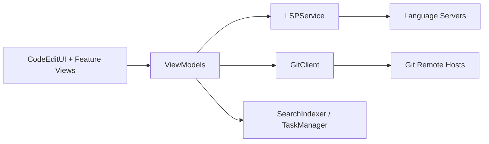

# CodeEditApp/CodeEdit

> Éditeur de code natif macOS écrit en Swift, développé par la communauté.

## Le problème
Les éditeurs courants reposent sur Electron, et Xcode ne convient qu'aux projets Apple.

## Ce que ce n'est pas
Le README annonce coloration syntaxique, complétion, recherche/remplacement, snippets, terminal, tâches, débogage, Git, revue de code et extensions ; il précise que le projet est en développement et déconseillé en production.

## Ce que ça fait vraiment
Application SwiftUI en MVVM avec modules par fonctionnalité. D'après le code : services pour le LSP (serveurs de langage), Git, l'indexation de recherche, les tâches, l'émulateur de terminal (SwiftTerm), le trousseau ; une extension Finder, des scripts d'intégration shell et une génération de flux de mise à jour (AppCast).

## Comment c'est branché

## Essayer
Aucune commande documentée dans le README fourni.

## Coût et pièges
Gratuit, macOS uniquement. Projet non prêt pour la production, selon son propre README.

## Ce que ce n'est pas
Ce n'est pas multiplateforme, ni un remplaçant stable de VS Code aujourd'hui.

## Alternatives
Aucune alternative nommée dans le README (Xcode est cité pour comparaison).

## Pour toi
Ignorer : éditeur macOS non stabilisé, sans support des notebooks ni de l'écosystème Python évoqué dans le README.

