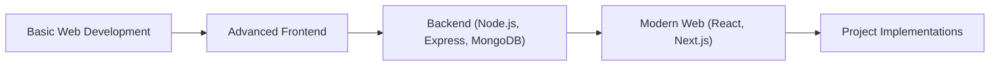

# CodeWithHarry/Sigma-Web-Dev-Course

> Code source d'un cours de développement web en hindi, pour débutants.

## Le problème
Les débutants qui préfèrent l'hindi manquent de cours de développement web dans leur langue.

## Ce que ça fait vraiment
Dépôt de code accompagnant une playlist YouTube : bases HTML, CSS, JavaScript, puis front-end, back-end et bases de données. D'après l'architecture décrite : Node.js, Express, MongoDB, React, Next.js, et des projets (Spotify Clone, gestionnaire de mots de passe, raccourcisseur d'URL, LinkTree).

## Comment c'est branché

## Essayer
Aucune commande dans le README ; le lien renvoie vers la playlist YouTube.

## Coût et pièges
Gratuit. Aucune licence déclarée : l'usage du code n'est pas autorisé explicitement. Dernier push le 2024-11-05.

## Ce que ce n'est pas
Pas une bibliothèque ni un outil : c'est du contenu pédagogique, et la promesse de nouveautés quotidiennes du README n'est plus tenue.

## Alternatives
Aucune alternative nommée dans le README.

## Pour toi
Ignorer : cours de web généraliste en hindi, hors sujet pour la data/IA, sans licence et sans mise à jour depuis plus d'un an.

