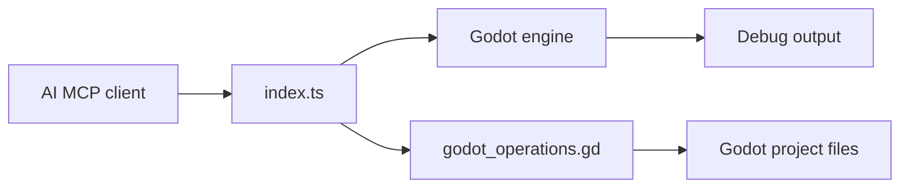

# Coding-Solo/godot-mcp

> Serveur MCP qui permet à un agent de lancer, déboguer et éditer des projets Godot.

## Le problème
Un agent qui écrit du code Godot ne voit jamais le résultat : pas d'exécution, pas de logs d'erreur.

## Ce que ça fait vraiment
Outils MCP : lancer l'éditeur, exécuter un projet en debug, récupérer la sortie console, arrêter.
Lister et analyser des projets, créer des scènes, ajouter des nœuds, charger des sprites, exporter une MeshLibrary.
Gestion des UID (Godot 4.4+).
Commandes simples via la CLI Godot, opérations complexes via un script `godot_operations.gd` piloté en JSON.

## Comment c'est branché


## Essayer
```bash
claude mcp add godot -- npx @coding-solo/godot-mcp
git clone https://github.com/Coding-Solo/godot-mcp.git
cd godot-mcp
npm install
npm run build
```

## Coût et pièges
Gratuit ; Godot et Node 18+ installés, `GODOT_PATH` si la détection échoue.

## Ce que ce n'est pas
Pas un éditeur complet : périmètre limité aux opérations listées. Le README propose d'auto-approuver tous les outils, ce qui retire tout contrôle.

## Alternatives
Aucune alternative nommée dans le README.

## Pour toi
À ignorer hors jeu vidéo : bon exemple de boucle de retour agent-exécution, mais aucun usage data/IA direct.
