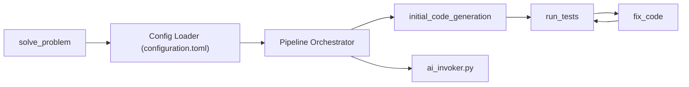

# Codium-ai/AlphaCodium

> Implémentation officielle d'un flux itératif par tests pour générer du code de programmation compétitive avec un LLM.

## Le problème
Les astuces de prompt pour le langage naturel marchent mal sur le code : syntaxe exacte, cas limites, détails de l'énoncé.

## Ce que ça fait vraiment
Le flux enchaîne : reformulation de l'énoncé, réflexion, solutions possibles, tests générés par l'IA, code initial, exécution sur tests publics puis IA, corrections itératives, choix de la meilleure solution. La configuration (`configuration.toml`) règle chaque étape et le modèle. Trois commandes : `solve_problem`, `solve_dataset`, `evaluate_dataset`. Selon les auteurs, le taux de réussite pass@5 de GPT-4 passe de 19 % à 44 % sur le jeu de validation CodeContests, avec 15 à 20 appels par solution.

## Comment c'est branché


## Essayer
```bash
python3 -m venv venv
source ./venv/bin/activate
pip install -r requirements.txt
python -m alpha_codium.solve_problem --dataset_name /path/to/dataset --split_name test --problem_number 0
```

## Coût et pièges
Il faut une clé OpenAI dans `alpha_codium/settings/.secrets.toml` et le jeu de données téléchargé depuis Hugging Face. Résoudre un jeu entier peut prendre plusieurs jours avec un grand modèle. La licence AGPL-3.0 est copyleft. Dernier push en novembre 2024.

## Ce que ce n'est pas
Ce n'est pas un assistant de code pour projets réels : il cible des problèmes de concours au format CodeContests. Les chiffres sont ceux des auteurs, avec des modèles de 2023 à contexte de 8192 jetons. Le README avertit que même 15 à 20 appels par solution peuvent être trop pour certaines applications.

## Alternatives
Aucune alternative nommée dans le README.

## Pour toi
À ignorer comme dépôt : gelé depuis fin 2024, sous AGPL et lié à des modèles anciens ; retiens plutôt les principes du README (sortie YAML, double validation, code modulaire) pour tes propres agents de code.
